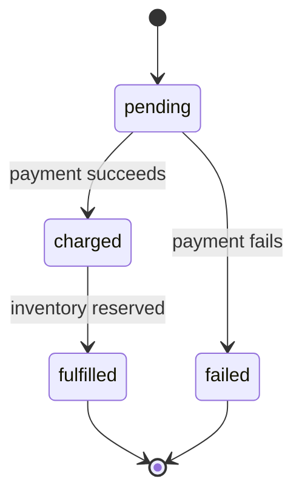

# Discovering and describing business logic

This reference covers the *behavioral* half of a codebase's domain: the workflows, decisions, calculations, and cross-aggregate rules that make the business actually do something. It is the complement to `domain-model.md`, which covers the *structural* half (entities, value objects, aggregates, their shape and invariants).

This reference is deliberately language- and framework-agnostic. Business logic is defined by what code *does*, not by the directory it lives in or the conventions of any framework. Teams diverge from framework conventions, and long-lived codebases accumulate custom layering that bears no resemblance to the framework's documented structure. Discover behavior by reading the code; do not assume it from path or class names.

Read this when generating pages for any of the following:

- A multi-step business process — checkout, onboarding, refund handling, dunning, fulfillment
- A decision or policy — pricing, eligibility, fraud detection, recommendations, access control
- A calculation or transformation — fees, taxes, discounts, scoring, currency conversion
- A cross-aggregate rule — "a customer cannot place an order while they have an unpaid invoice"
- A rule engine, decision table, or strategy/policy dispatcher

If a page's main content is "what fields does this thing have and what states can it be in", that's a domain-model page — see `domain-model.md`. If a page's main content is "how does the system decide X" or "what happens when Y", that's a business-logic page — read on.

## Contents

- [Why this matters](#why-this-matters)
- [What business logic is](#what-business-logic-is)
- [Where business logic lives in the wiki](#where-business-logic-lives-in-the-wiki)
- [Categories](#categories)
  - [Workflows and processes](#workflows-and-processes)
  - [Decisions and policies](#decisions-and-policies)
  - [Calculations and transformations](#calculations-and-transformations)
  - [Cross-aggregate rules](#cross-aggregate-rules)
- [Discovery](#discovery)
  - [How to find behavioral code](#how-to-find-behavioral-code)
  - [Workflow signals](#workflow-signals)
  - [Policy signals](#policy-signals)
  - [Calculation signals](#calculation-signals)
  - [Cross-aggregate rule signals](#cross-aggregate-rule-signals)
- [Page templates](#page-templates)
  - [Workflow page](#workflow-page)
  - [Policy page](#policy-page)
  - [Calculation page](#calculation-page)
- [Diagram choices](#diagram-choices)
- [Worked example](#worked-example)
- [Common pitfalls](#common-pitfalls)

## Why this matters

Business logic is the part of the codebase where revenue is made or lost, where customers are charged or refunded, where fraud is caught or missed, where a regulatory rule is satisfied or violated. It is also the part that is hardest to reconstruct from the type definitions — a class signature tells you nothing about *how* a price is computed, only that it is.

A reader who needs to change a price, add a fraud rule, or debug why a refund didn't fire cannot do so safely from a schema dump. They need to know: where does this decision live, what inputs does it take, what are the branches, what are the side effects, and what depends on the output. That picture is almost always spread across multiple units — entry points, helpers, data lookups, side effects — and the wiki page is where it finally gets stitched together.

If the wiki documents the entities and skips the logic, every reader is one refactor away from making an expensive mistake.

## What business logic is

For wiki purposes, **business logic** is any code that decides, computes, or orchestrates something the business cares about. It is behavior, not structure. The categories below are not mutually exclusive — a checkout flow contains decisions, calculations, and cross-aggregate rules all working together — but separating them helps you find each kind in the code and choose the right page template.

The four categories covered here:

- **Workflows and processes** — sequences of steps that move a business thing through a process (checkout, onboarding, fulfillment, dunning). Often long-running, often with retries and compensation.
- **Decisions and policies** — functions that answer a question ("is this customer eligible?", "what price should we charge?", "is this transaction fraudulent?"). Often branchy, often configurable.
- **Calculations and transformations** — formulas and mappers that turn inputs into outputs ("compute the total with tax", "convert currency", "score this lead"). Often pure, often reused.
- **Cross-aggregate rules** — invariants that span multiple aggregates ("no new order while an invoice is unpaid"). The trickiest category because they don't fit naturally inside any single aggregate.

These categories intentionally overlap with the invariants section of `domain-model.md`. The split is: an invariant that lives *inside* one aggregate (and is enforced by that aggregate's own methods) belongs on the aggregate's primitives page. A rule that lives *across* aggregates, or that is implemented by code outside the aggregates themselves, belongs here.

## Where business logic lives in the wiki

The wiki has several homes for business logic depending on its shape:

| Kind of logic | Typical home | Why |
|---|---|---|
| User-visible or cross-system workflow (checkout, onboarding) | `features/` | It's a cross-cutting capability, not owned by one subsystem |
| Internal decision engine with its own subsystem (pricing, fraud) | `systems/` | It's an architectural component other code calls into |
| Background process (dunning, ETL, batch jobs) | `systems/` or a dedicated page under the relevant lens | It runs autonomously |
| Calculation reused across the codebase | Page on the subsystem that owns it, cross-linked from callers | Don't duplicate |
| Cross-aggregate rule | Dedicated page in `features/` (if user-visible) or `systems/` (if internal), plus a one-line pointer on each affected primitives page | The rule spans aggregates, so it can't live on any one of them |
| API operation with significant logic (e.g., `POST /refunds`) | `api/` page for the endpoint + cross-link to the underlying workflow/policy page | Don't put the workflow inside the API page |

When in doubt, ask: "if a reader wanted to change this logic, where would they look first?" That's the page. Cross-link from every other page that touches it.

## Categories

### Workflows and processes

A workflow is a sequence of steps that moves a business thing from one state to another, often across multiple aggregates and collaborators. Examples: checkout (cart → order → payment → fulfillment), user onboarding (signup → verify email → provision account → welcome email), refund processing (request → validate → issue credit → notify), dunning (payment fails → retry N times → cancel).

Properties that distinguish workflows from other logic:

- **Multi-step** — at least 3 distinct steps, often many more.
- **Stateful** — the workflow itself has a current step / status that persists between operations.
- **Long-running** — minutes, hours, or days, not milliseconds. Often survives process restarts.
- **Coordinated** — touches multiple aggregates or external systems (payments, email, inventory).
- **Failure-aware** — has retry, compensation, or rollback logic. Steps can fail and need recovery.
- **Often event-driven** — progresses by consuming events emitted by other parts of the system.

Common implementation shapes:

- **Orchestrator** — a unit that calls each step in sequence (e.g., a method that validates, charges, fulfills, and notifies in one body).
- **Saga** — a sequence of local transactions where each step has a compensating action, used when a single distributed transaction isn't possible.
- **Process manager** — an event-driven state machine that reacts to events and issues commands.
- **Workflow engine** — the workflow is declared as code or configuration, and a dedicated engine handles persistence and retries.
- **State machine on an aggregate** — when the workflow is fully captured by the aggregate's state field and methods. (Borderline with domain-model — if the workflow is fully inside one aggregate, document it there.)
- **Background processor** — a single-purpose unit tied to a queue or schedule.

### Decisions and policies

A decision or policy is logic that answers a question or makes a choice. Examples: "is this customer eligible for the trial?", "what price should we charge for this plan in this region?", "is this transaction likely fraudulent?", "which shipping carrier should we use?", "what discount does this coupon grant?".

Properties:

- **Mostly pure** — given the same inputs, returns the same output (or close to it; some policies are time-sensitive).
- **Branchy** — many conditionals, often nested.
- **Configurable** — rules are often parameterized (rates, thresholds, feature flags) and change more often than the surrounding code.
- **Frequently versioned** — the answer for a past date might matter (what was the price on Jan 3?).
- **Output is a decision** — a value, a category, an approval/denial, a recommended action.

Common implementation shapes:

- **Service method** — `priceFor(plan, customer, region)`.
- **Strategy / Policy pattern** — a family of interchangeable implementations behind a common interface (`ShippingCarrierStrategy`, `DiscountPolicy`).
- **Rule engine** — rules are data rather than code, evaluated by an engine.
- **Decision table** — a matrix of conditions and actions, often a configuration file.
- **Feature-flag-gated branches** — when a decision differs by tenant or rollout.
- **ML model** — when the decision is a prediction (fraud score, recommendation, churn risk). The model is the policy; its inputs and decision threshold are the surrounding logic.

### Calculations and transformations

A calculation is a pure function that turns inputs into outputs using a formula or mapping. Examples: "compute order total with tax and discounts", "convert 100 USD to EUR", "score this lead from 0 to 100", "compute the prorated refund for a partially-used subscription", "parse and validate this address into a canonical form".

Properties:

- **Pure** — no side effects, no I/O. Given inputs, deterministic output.
- **Formula-driven** — the body is mostly arithmetic, string manipulation, or lookups.
- **Reusable** — called from many places; the same calculation shows up in checkout, reporting, exports.
- **Stable interface, evolving body** — the signature rarely changes; constants and coefficients change often (tax rates, exchange rates).
- **Sometimes time-sensitive** — exchange rates and tax rates are valid as of a date.

Common implementation shapes:

- **Pure function** — `computeTotal(order)`, `convertCurrency(amount, from, to, date)`.
- **Utility module** — a thin wrapper around a rate table or formula set.
- **Lookup table** — hardcoded rates, configuration files, or database tables backing the calculation.
- **External reference data** — rates or reference values come from an external API; the policy is "use the external source's value as of the request date".
- **Value object method** — `Money.add`, `DateRange.overlaps`. These belong on primitives pages unless the calculation is complex enough to deserve its own page.

### Cross-aggregate rules

A cross-aggregate rule is an invariant that cannot be enforced inside any single aggregate because it depends on data owned by multiple aggregates. Examples: "a customer cannot place a new order while they have an unpaid invoice", "a user can have at most one active subscription per product", "a reservation cannot overlap another reservation for the same resource", "an employee's total compensation cannot exceed the department budget".

Properties:

- **Span aggregates** — checking the rule requires reading multiple aggregates.
- **Race-prone** — concurrent transactions can violate the rule if not coordinated.
- **Often enforced at a layer above the aggregates** — application code, event handlers, or database constraints.
- **Sometimes eventual** — for performance, the rule is checked asynchronously and violations are reconciled later.

Common implementation shapes:

- **Application-service check** — code queries a second repository before acting on the first.
- **Database constraint** — partial unique indexes, exclusion constraints, or check constraints. The most reliable enforcement.
- **Distributed or advisory lock** — serializes operations on a shared key.
- **Saga with reservation** — reserve the resource in step 1, confirm in step 2, release on failure.
- **Eventual reconciliation** — emit events, project into a read model, alert on violations. Used when strict enforcement is too expensive.

## Discovery

### How to find behavioral code

Business logic is defined by what code *does*, not by where it lives or what it is named. Discover it by behavior, then verify by reading the body. Do not treat directory or class conventions as authoritative — teams diverge from framework conventions, and long-lived codebases accumulate custom layering. A workflow can live in a dedicated service class, a controller action, a model method, a queue callback, or a free function.

Use these five methods together. They are ordered roughly from most to least reliable, but all five contribute.

**1. Trace from entry points.** List every entry point the repo actually has — HTTP routes, CLI entry points, queue consumers, scheduled jobs, event listeners, message handlers — whatever the project calls them and wherever they live. Read each one and follow the call graph two to three hops deep. Orchestration, branching, and computation happen in the units those entry points call. This is the most reliable method because it follows actual execution rather than assumed conventions. An entry point that the framework registers via a decorator, a configuration file, a naming convention, or a route table all look the same once you follow the calls.

**2. Grep for behavioral lexical patterns.** Search for the vocabulary of behavior, not the vocabulary of structure:

- **Orchestration** — methods that call several other units in one body; message-dispatch and event-publish calls (`dispatch`, `publish`, `emit`, `notify`, bus sends).
- **Decisions** — methods returning a boolean or category (`is*`, `should*`, `can*`, `has*`, `classify`, `resolve`, `recommend`); dense conditional blocks.
- **Computation** — arithmetic-heavy bodies, lookup-table access, verb-named methods (`compute`, `calculate`, `convert`, `format`, `score`, `rank`, `normalize`).
- **Concurrency and recovery** — `retry`, `compensate`, `rollback`, lock acquisition, dead-letter and failure handling.

**3. Measure complexity.** The functions with the highest cyclomatic complexity, the longest bodies, or the deepest nesting are usually policies or workflows. Sort source files by size and conditional density and read the top of each list. Many linters and language servers report complexity directly; where they don't, body length and conditional count are a usable proxy.

**4. Follow test density.** Functions with disproportionate unit-test coverage are high-stakes calculations or policies — teams test what matters. A pure function with thirty tests is almost certainly worth its own page.

**5. Inspect the data layer.** The storage layer is the most authoritative and convention-independent source of cross-aggregate rules. Read every schema definition and migration: partial unique indexes, exclusion constraints, and check constraints are invariants enforced regardless of application layout. Triggers and stored procedures sometimes hold logic that exists nowhere else. Reference-data and configuration files (rate tables, rule sets, decision tables, feature-flag definitions) are data-driven policies — when their values change, behavior changes, so document where they live, who edits them, and how changes roll out.

**Naming is a hint, not a filter.** Class and method names ending in `Service`, `Manager`, `Handler`, `Command`, `Processor`, `Policy`, `Strategy`, `Calculator`, `Engine`, or `Workflow` often mark behavioral code. Use these names to prioritize where to read first, but do not restrict the search to them, and do not assume every such name is behavioral. Verify by reading the body: a unit named `UserService` that only reads and writes a row is a thin wrapper; a method named `process` inside an oddly named unit that calls five collaborators is a workflow.

**When there is no application layer.** Many codebases have no service or use-case layer; the logic lives directly in HTTP handlers, controller actions, model methods, or route callbacks. These are often the longest functions in the codebase. Treat a fat handler the same way you would treat a dedicated service: trace it, categorize it, and document it as a workflow or policy page if its body is behavioral.

### Workflow signals

- **Methods that call multiple collaborators in sequence** — a single body invoking validate, charge, fulfill, and notify in order.
- **Status fields with many values** — `draft | submitted | paid | shipped | delivered | cancelled | refunded`. The state machine is the workflow.
- **Producers and consumers of messages** — a publish or dispatch call paired with a handler that reacts to it.
- **Retry and compensation code** — retry loops, compensate-on-failure branches, rollback handlers. Workflow engines have these built in; hand-rolled workflows often have ad-hoc versions.
- **Workflow-engine declarations** — explicit workflow or activity definitions, state-machine configurations, or dedicated DSL files.
- **Long-running methods** — functions with timeouts, polling loops, or await chains spanning many collaborators.
- **Status transition methods on aggregates** — when an aggregate's methods form a coherent state machine, the workflow is encoded inside the aggregate (borderline with domain-model).

### Policy signals

- **Methods returning a category or decision** — `isEligible()`, `shouldApprove()`, `classify()`, `recommend()`. The return type is often an enum or boolean.
- **Branchy code** — high conditional density. Sort functions by branching count (`if` / `switch` / `case` / pattern-match arms); policy code rises to the top.
- **Many short methods on one class** — `applyTier1Discount`, `applyTier2Discount`, `applyLoyaltyDiscount`. Strategy pattern.
- **Config-driven branches** — `if threshold > score`. The threshold is the rule.
- **Strategy or Policy interfaces** — a common interface with multiple implementations. Each implementation is one alternative.
- **Rule-engine data** — rule definition files (proprietary DSLs, JSON/YAML rule sets, decision tables). The data is the logic.
- **Feature flag checks** — `if flags.useNewPricingEngine`. The flag toggles which policy is active.
- **ML model invocations** — a prediction call. The model is the policy; its inputs and decision threshold are the surrounding logic.

### Calculation signals

- **Pure functions with arithmetic bodies** — `return subtotal + tax - discount`. Look for arithmetic operators, rounding calls, and decimal/fixed-point types.
- **Lookup tables** — hardcoded rate maps or reference-data structures. The table is half the logic.
- **External rate calls** — a call that fetches a rate or reference value. The policy is "use the external source's value".
- **Methods named like verbs** — `compute`, `calculate`, `convert`, `format`, `parse`, `normalize`, `score`, `rank`.
- **Value object arithmetic** — `Money.add`, `Money.multiply`. Complex arithmetic on value objects often deserves its own page.
- **Date- or time-sensitive parameters** — `convert(amount, from, to, asOf)`. The `asOf` parameter is the giveaway that the calculation depends on a point in time.
- **Heavy unit-test coverage on one function** — calculation code attracts tests because it's pure and high-stakes. A function with 30 tests is almost certainly a calculation worth documenting.

### Cross-aggregate rule signals

- **Code that queries multiple repositories in one operation** — a unit reading both an order store and an invoice store before acting. The rule spans both.
- **Partial unique indexes** — `CREATE UNIQUE INDEX ... WHERE status = 'active'`. The most reliable cross-aggregate rule enforcement.
- **Exclusion constraints** — constraints that prevent overlapping ranges or conflicting rows for the same key. Classic for "no overlapping reservations".
- **Advisory or distributed locks** — transaction-scoped locks on a shared key, used to serialize operations.
- **Saga patterns with compensation** — reserve → confirm → release. The reservation step exists because of a cross-aggregate rule.
- **Comments warning about race conditions** — "must hold lock on customer_id before checking balance". The comment names the rule.
- **Reconciliation jobs** — units that scan for violations and alert. They exist because the rule isn't enforced inline.

## Page templates

The skeletons below use a hypothetical checkout/pricing/billing example to show section structure. They are illustrative only. In a real page, replace every file path, type signature, and identifier with the ones from the repo you are documenting, in that repo's language and layout. Do not copy the example paths.

### Workflow page

A workflow page captures a multi-step business process. Recommended sections:

0. **Active contributors** — byline (see SKILL.md "Per-page active contributors").
1. **Summary** — 1-3 sentences: what this workflow accomplishes, in business terms.
2. **Trigger** — what starts it (user action, event, schedule, manual).
3. **Steps** — the ordered list of steps, each with what it does and what it calls.
4. **State machine** — Mermaid `stateDiagram-v2` if the workflow has explicit states.
5. **Sequence diagram** — Mermaid `sequenceDiagram` showing the participants and message flow.
6. **Failure and recovery** — what happens when a step fails. Retries, compensation, dead-letter queues, manual intervention.
7. **Side effects** — what gets created, modified, or emitted (events, emails, external API calls).
8. **Concurrency** — can two instances run at once for the same entity? How is that prevented or coordinated?
9. **Key source files** — the table required by SKILL.md section 3d.

Template skeleton:

````markdown
# Checkout

Active contributors: alice, bob

The end-to-end flow that turns a shopping cart into a paid, fulfillment-ready order.

## Trigger

A checkout request from the web client, after the user clicks "Place order".

## Steps

1. **Validate cart** — confirms items are in stock and prices match.
2. **Charge payment** — calls the payment provider.
3. **Create order** — writes the Order aggregate.
4. **Reserve inventory** — decrements stock.
5. **Emit OrderPlaced** — published to the event bus; triggers fulfillment and email.

## State machine



## Failure and recovery

- **Payment failure** — cart is preserved; user can retry. No compensation needed (nothing was persisted).
- **Inventory reservation failure after charge** — a compensation worker issues a refund and emits `OrderCancelled`. Runs within 60s; alerts ops if it fails.
- **Event publish failure** — outbox pattern: events are written to an outbox table in the same transaction as the order; a relay publishes them.

## Side effects

- Creates: `Order`, `Payment`, `InventoryReservation`.
- Emits: `OrderPlaced`, `PaymentCaptured`.
- External calls: payment provider charge API, warehouse reservation API.

## Concurrency

Checkout for a given cart is serialized by a lock on `cart_id`. Two checkouts for the same cart cannot run concurrently; the second waits or fails fast depending on the `wait` flag.

## Key source files

| File | Purpose |
|---|---|
| `src/checkout/CheckoutService.ts` | Orchestrates the workflow |
| `src/checkout/CheckoutStateMachine.ts` | State transitions and validation |
| `src/checkout/RefundOnFailureWorker.ts` | Compensation for post-charge failures |
````

### Policy page

A policy page captures a decision or set of rules. Recommended sections:

0. **Active contributors** — byline.
1. **Summary** — what question this policy answers, in business terms.
2. **Inputs** — the data the decision is based on. A table of fields, types, sources.
3. **Output** — what the policy returns (a value, a category, a recommendation).
4. **Rules** — the actual branches. A table or numbered list, each rule sourced to the file/line/config key that defines it.
5. **Configuration** — what's parameterized (thresholds, feature flags, tenant overrides) and where those values live.
6. **Versioning** — if the policy is time-sensitive, how historical decisions are reproducible (snapshot tables, dated config, model versions).
7. **Examples** — 2-3 worked input/output pairs that exercise different branches.
8. **Key source files** — table.

Template skeleton:

````markdown
# Pricing

Active contributors: carol, dave

Decides the price a customer pays for a plan in a given region, accounting for tier, currency, and active promotions.

## Inputs

| Field | Type | Source |
|---|---|---|
| planId | PlanId | request |
| customerId | CustomerId | session |
| region | RegionCode | request header |
| couponCode | string? | request body |

## Output

A `Price` value object (amount + currency + breakdown) plus a list of applied discounts.

## Rules

1. Base price is `plan.basePrice` in the customer's region, looked up from the pricing configuration.
2. Annual billing gets a 17% discount applied to the base.
3. Promo codes override individual discount rules; multiple stack unless marked exclusive.
4. Prices are rounded down to the nearest 0.05 in CHF regions, nearest 0.01 elsewhere.

## Configuration

- Base prices per plan × region — maintained in the pricing configuration file.
- Active promo codes and rules — maintained in the promotions configuration file.
- Feature flag `use_v3_pricing_engine` — toggles the new pricer for 10% of traffic.

## Versioning

Historical prices are reproducible from a price-history table keyed by `(plan_id, region, effective_at)`. Promo effectiveness is snapshotted at redemption time on the redemption record.

## Examples

| Input | Output | Why |
|---|---|---|
| Pro plan, US, monthly, no coupon | $29.00 USD | Base price |
| Pro plan, US, annual, no coupon | $289.11 USD | Base × 12 × 0.83 |
| Pro plan, US, annual, WELCOME20 | $231.29 USD | Annual base × 0.80 |

## Key source files

| File | Purpose |
|---|---|
| `src/pricing/PricingService.ts` | Entry point; dispatches to rule engine |
| `src/pricing/rules.ts` | Discount and tier rules |
| `config/pricing.yml` | Base price table |
````

### Calculation page

A calculation page captures a pure function or set of related functions. Recommended sections:

0. **Active contributors** — byline.
1. **Summary** — what the function computes, in business terms.
2. **Signature** — the function's input and output types.
3. **Formula** — the actual computation, written out. Use a code block or math-style notation.
4. **Inputs** — table of fields, types, sources, and validation rules.
5. **Constants and lookups** — the rates, coefficients, or tables the formula depends on, and where they come from.
6. **Edge cases** — rounding, overflow, zero, negatives, empty inputs.
7. **Tests** — pointer to the test file(s) and what they cover.
8. **Key source files** — table.

Template skeleton:

````markdown
# Prorated refund

Active contributors: eve

Computes the refund amount when a subscription is cancelled mid-period.

## Signature

```
proratedRefund(subscription: Subscription, asOf: DateTime) -> Money
```

## Formula

```
refund = (periodPrice * remainingDays) / totalDays
```

Where `remainingDays = periodEnd - asOf` and `totalDays = periodEnd - periodStart`.

## Inputs

| Field | Type | Source |
|---|---|---|
| subscription.periodStart | DateTime | Subscription aggregate |
| subscription.periodEnd | DateTime | Subscription aggregate |
| subscription.paidAmount | Money | Subscription aggregate |
| asOf | DateTime | Cancellation request timestamp |

## Constants and lookups

None. The formula uses only the subscription's own fields.

## Edge cases

- **Cancellation on the period start date** — returns the full paid amount.
- **Cancellation on the period end date** — returns zero.
- **Currency rounding** — rounds to the currency's minor unit (e.g., 0.01 for USD, 0.05 for CHF) using banker's rounding.

## Tests

The prorated-refund test suite — 42 cases covering boundaries, currencies, and leap years.

## Key source files

| File | Purpose |
|---|---|
| `src/billing/prorated-refund.ts` | The function |
| `src/billing/prorated-refund.test.ts` | Test suite |
````

For cross-aggregate rules, document them on whichever page is the natural entry point (usually the workflow or service that enforces them), and add a one-line pointer on each affected primitives page so readers find the rule from either direction.

## Diagram choices

| Question | Diagram |
|---|---|
| What are the steps of this workflow, in order? | `sequenceDiagram` across the participants |
| What states can the workflow be in? | `stateDiagram-v2` |
| How do the collaborators depend on each other? | `graph TD` of caller → callee |
| How does the policy branch? | A decision table or numbered list (Mermaid `flowchart` for branching is usually more clutter than clarity) |
| What events fire during the workflow? | `sequenceDiagram` with `->>Bus: EventName` arrows |

Keep diagrams focused. A workflow that has 12 steps is better shown as two sequence diagrams (e.g., "happy path" and "failure path") than one giant one.

## Worked example

This example is illustrative — it shows how to turn a set of observed signals into a page. It does not imply that every codebase contains a `CheckoutService`, nor that workflows always live in a dedicated service class. Apply the same reasoning to whatever behavioral code you actually find, wherever it lives.

Suppose the survey surfaces an orchestration unit with a method that calls validate, charge, create-order, and reserve-inventory, in that order. There is a compensation worker subscribed to payment-captured events, and a lock is acquired on the cart identifier at the top of the orchestrator. The state machine has states `pending`, `charged`, `fulfilled`, `failed`. A grep for thrown errors finds payment-declined, out-of-stock, and cart-validation errors.

From these signals:

- **Category**: workflow (multi-step, stateful, coordinated, failure-aware).
- **Steps**: validate → charge → create order → reserve inventory → emit event. Five distinct steps.
- **State machine**: `pending → charged → fulfilled` (happy path) and `pending → failed` / `charged → failed` (failure paths).
- **Failure and recovery**: payment failure is recoverable (user retries); post-charge failure triggers the compensation worker. Document both paths.
- **Side effects**: order, payment, and inventory-reservation aggregates created; order-placed and payment-captured events emitted; payment and warehouse external systems called.
- **Concurrency**: serialized by the lock on the cart identifier.
- **Invariants** (cross-aggregate): cart must be valid, items must be in stock, payment must succeed.

Write the page using the workflow template above. Each step links to the unit that implements it. The state machine and sequence diagrams together let a reader trace any path through the workflow without reading the orchestrator end-to-end.

## Common pitfalls

- **Assuming the team followed framework conventions.** A directory whose name suggests services may contain thin data access, and a workflow may live in a controller, a model method, or a free function with an unconventional name. Discover by behavior — entry-point tracing, lexical signals, complexity, test density — and verify by reading. Long-lived codebases diverge from conventions; the absence of conventionally-named files does not mean there is no business logic.
- **Mixing the workflow with the entities it touches.** A checkout page should explain the *flow*, not document the Order or Payment aggregates. Link to their primitives pages instead of repeating their content.
- **Skipping failure paths.** Happy paths are easy to write; failure and compensation are where the real complexity (and the real bugs) live. Document every failure mode and how the system recovers — or doesn't.
- **Documenting policies as code rather than rules.** A page that walks through the implementation line by line is a code walkthrough, not a policy page. Readers want the rules and the configuration, not the loops and branches.
- **Forgetting data-driven logic.** When a rule lives in a configuration file or reference-data table, the wiki page must say so and link to it. Otherwise a reader who only reads the code will miss half the policy.
- **Treating cross-aggregate rules as invariants on one aggregate.** A rule that depends on two aggregates doesn't belong on either primitives page; it belongs on a dedicated page (or the enforcing unit's page) with pointers from both.
- **Missing the concurrency story.** Workflows that touch shared state have a concurrency model — locks, queues, single-writer patterns. Omitting it leaves readers to discover races the hard way.
- **Cramming every calculation into one page.** A utility module with 20 small calculations does not deserve 20 pages. Document the high-stakes ones (the ones with extensive tests, regulatory weight, or frequent bugs) and list the rest in a table on the owning subsystem's page.
- **Skipping external dependencies.** Workflows and policies that call external systems (payment providers, tax services, ML models) should name the dependency, what it's called for, and what happens when it's down. The external system is part of the workflow's behavior.
- **Drawing the wrong diagram.** Sequence diagrams are for workflows, not for static structure. State diagrams are for state machines, not for class hierarchies. Match the diagram type to the question.
- **Documenting the implementation, not the behavior.** A reader who wants to know "what does the system do when a refund is requested" doesn't need a tour of the class hierarchy. They need the steps, the decisions, and the side effects. Implementation details belong in the key source files table, not in the prose.
