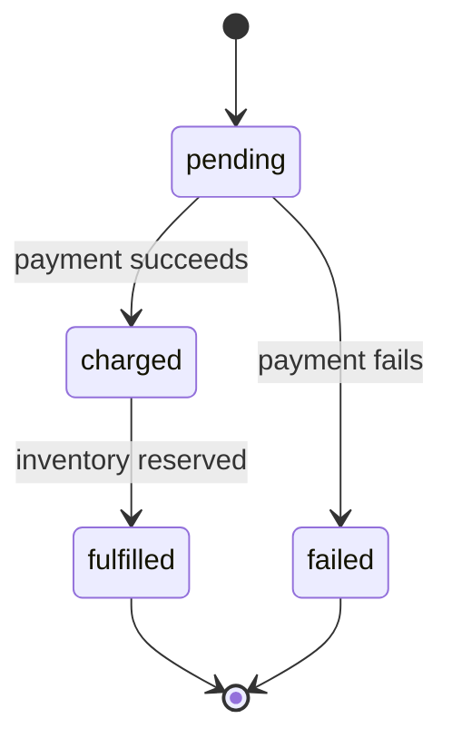

# Discovering and describing business logic

This reference covers the *behavioral* half of a codebase's domain: the workflows, decisions, calculations, and cross-aggregate rules that make the business actually do something. It is the complement to `domain-model.md`, which covers the *structural* half (entities, value objects, aggregates, their shape and invariants).

Read this when generating pages for any of the following:

- A multi-step business process — checkout, onboarding, refund handling, dunning, fulfillment
- A decision or policy — pricing, eligibility, fraud detection, recommendations, access control
- A calculation or transformation — fees, taxes, discounts, scoring, currency conversion
- A cross-aggregate rule — "a customer cannot place an order while they have an unpaid invoice"
- A rule engine, decision table, or strategy/policy dispatcher

If a page's main content is "what fields does this thing have and what states can it be in", that's a domain-model page — see `domain-model.md`. If a page's main content is "how does the system decide X" or "what happens when Y", that's a business-logic page — read on.

## Contents

- [Why this matters](#why-this-matters)
- [What business logic is](#what-business-logic-is)
- [Where business logic lives in the wiki](#where-business-logic-lives-in-the-wiki)
- [Categories](#categories)
  - [Workflows and processes](#workflows-and-processes)
  - [Decisions and policies](#decisions-and-policies)
  - [Calculations and transformations](#calculations-and-transformations)
  - [Cross-aggregate rules](#cross-aggregate-rules)
- [Discovery signals](#discovery-signals)
  - [Where logic hides in code](#where-logic-hides-in-code)
  - [Workflow signals](#workflow-signals)
  - [Policy signals](#policy-signals)
  - [Calculation signals](#calculation-signals)
  - [Cross-aggregate rule signals](#cross-aggregate-rule-signals)
- [Discovery by source kind](#discovery-by-source-kind)
- [Page templates](#page-templates)
  - [Workflow page](#workflow-page)
  - [Policy page](#policy-page)
  - [Calculation page](#calculation-page)
- [Diagram choices](#diagram-choices)
- [Worked example](#worked-example)
- [Common pitfalls](#common-pitfalls)

## Why this matters

Business logic is the part of the codebase where revenue is made or lost, where customers are charged or refunded, where fraud is caught or missed, where a regulatory rule is satisfied or violated. It is also the part that is hardest to reconstruct from the type definitions — a `PricingEngine` class signature tells you nothing about *how* prices are computed, only that they are.

A reader who needs to change a price, add a fraud rule, or debug why a refund didn't fire cannot do so safely from a schema dump. They need to know: where does this decision live, what inputs does it take, what are the branches, what are the side effects, and what depends on the output. That picture is almost always spread across multiple files — services, handlers, workers, events — and the wiki page is where it finally gets stitched together.

If the wiki documents the entities and skips the logic, every reader is one refactor away from making an expensive mistake.

## What business logic is

For wiki purposes, **business logic** is any code that decides, computes, or orchestrates something the business cares about. It is behavior, not structure. The categories below are not mutually exclusive — a checkout flow contains decisions, calculations, and cross-aggregate rules all working together — but separating them helps you find each kind in the code and choose the right page template.

The four categories covered here:

- **Workflows and processes** — sequences of steps that move a business thing through a process (checkout, onboarding, fulfillment, dunning). Often long-running, often with retries and compensation.
- **Decisions and policies** — pure-ish functions that answer a question ("is this customer eligible?", "what price should we charge?", "is this transaction fraudulent?"). Often branchy, often configurable.
- **Calculations and transformations** — formulas and mappers that turn inputs into outputs ("compute the total with tax", "convert currency", "score this lead"). Often pure, often reused.
- **Cross-aggregate rules** — invariants that span multiple aggregates ("no new order while an invoice is unpaid"). The trickiest category because they don't fit naturally inside any single aggregate.

These categories intentionally overlap with the invariants section of `domain-model.md`. The split is: an invariant that lives *inside* one aggregate (and is enforced by that aggregate's methods) belongs on the aggregate's primitives page. A rule that lives *across* aggregates, or that is implemented by a service rather than by the aggregate itself, belongs here.

## Where business logic lives in the wiki

The wiki has several homes for business logic depending on its shape:

| Kind of logic | Typical home | Why |
|---|---|---|
| User-visible or cross-system workflow (checkout, onboarding) | `features/` | It's a cross-cutting capability, not owned by one subsystem |
| Internal decision engine with its own service (pricing, fraud) | `systems/` | It's an architectural component other code calls into |
| Background process (dunning, ETL, batch jobs) | `systems/` or a dedicated `jobs/` / `workers/` page | It runs autonomously |
| Calculation reused across the codebase | Page on the system that owns it, cross-linked from callers | Don't duplicate |
| Cross-aggregate rule | Dedicated page in `features/` (if user-visible) or `systems/` (if internal), plus a one-line pointer on each affected primitives page | The rule spans aggregates, so it can't live on any one of them |
| API operation with significant logic (e.g., `POST /refunds`) | `api/` page for the endpoint + cross-link to the underlying workflow/policy page | Don't put the workflow inside the API page |

When in doubt, ask: "if a reader wanted to change this logic, where would they look first?" That's the page. Cross-link from every other page that touches it.

## Categories

### Workflows and processes

A workflow is a sequence of steps that moves a business thing from one state to another, often across multiple aggregates and services. Examples: checkout (cart → order → payment → fulfillment), user onboarding (signup → verify email → provision account → welcome email), refund processing (request → validate → issue credit → notify), dunning (payment fails → retry N times → cancel).

Properties that distinguish workflows from other logic:

- **Multi-step** — at least 3 distinct steps, often many more.
- **Stateful** — the workflow itself has a current step / status that persists between operations.
- **Long-running** — minutes, hours, or days, not milliseconds. Often survives process restarts.
- **Coordinated** — touches multiple aggregates or external systems (payments, email, inventory).
- **Failure-aware** — has retry, compensation, or rollback logic. Steps can fail and need recovery.
- **Often event-driven** — progresses by consuming events emitted by other parts of the system.

Common implementation patterns:

- **Orchestrator service** — a class or service that calls each step in sequence (`CheckoutService.placeOrder()`).
- **Saga** — a sequence of local transactions where each step has a compensating action (used when a single distributed transaction isn't possible).
- **Process manager** — an event-driven state machine that reacts to events and issues commands.
- **Workflow engine** — Temporal, Step Functions, Airflow, Celery, Sidekiq, Hangfire, Quartz. The workflow is declared as code or config and the engine handles persistence and retries.
- **State machine on an aggregate** — when the workflow is fully captured by the aggregate's state field and methods. (This case is borderline with domain-model — if the workflow is fully inside one aggregate, document it there.)
- **Background job / queue worker** — single-purpose processors tied to a queue (`RefundProcessor`, `DunningWorker`).

### Decisions and policies

A decision or policy is logic that answers a question or makes a choice. Examples: "is this customer eligible for the trial?", "what price should we charge for this plan in this region?", "is this transaction likely fraudulent?", "which shipping carrier should we use?", "what discount does this coupon grant?".

Properties:

- **Mostly pure** — given the same inputs, returns the same output (or close to it; some policies are time-sensitive).
- **Branchy** — lots of conditionals, often nested.
- **Configurable** — rules are often parameterized (rates, thresholds, feature flags) and change more often than the surrounding code.
- **Frequently versioned** — the answer for a past date might matter (what was the price on Jan 3?).
- **Output is a decision** — a value, a category, an approval/denial, a recommended action.

Common implementation patterns:

- **Service method** — `PricingService.priceFor(plan, customer, region)`.
- **Strategy / Policy pattern** — a family of interchangeable implementations behind a common interface (`ShippingCarrierStrategy`, `DiscountPolicy`).
- **Rule engine** — Drools, NRules, json-rules-engine, AWS EventBridge rules. Rules are data, not code.
- **Decision table** — a 2D matrix of conditions and actions, often a YAML/JSON/CSV file.
- **Feature-flag-gated branches** — when a decision differs by tenant or rollout.
- **ML model** — when the decision is a prediction (fraud score, recommendation, churn risk). The model is the policy.

### Calculations and transformations

A calculation is a pure function that turns inputs into outputs using a formula or mapping. Examples: "compute order total with tax and discounts", "convert 100 USD to EUR", "score this lead from 0 to 100", "compute the prorated refund for a partially-used subscription", "parse and validate this address into a canonical form".

Properties:

- **Pure** — no side effects, no I/O. Given inputs, deterministic output.
- **Formula-driven** — the body is mostly arithmetic, string manipulation, or lookups.
- **Reusable** — called from many places; the same calculation shows up in checkout, reporting, exports.
- **Stable interface, evolving body** — signature rarely changes; constants and coefficients change often (tax rates, exchange rates).
- **Sometimes time-sensitive** — exchange rates and tax rates are valid as of a date.

Common implementation patterns:

- **Pure function** — `computeTotal(order)`, `convertCurrency(amount, from, to, date)`.
- **Static utility class** — `TaxCalculator`, `CurrencyConverter` (often a thin wrapper around a rate table).
- **Lookup table** — hardcoded rates, config files, or DB tables backing the calculation.
- **External service** — when rates come from an API (Fixer, Open Exchange Rates, TaxJar). The calculation calls out; the policy is "use today's rate".
- **Value object with a method** — `Money.add(other)`, `DateRange.overlaps(other)`. (These belong on primitives pages, not here, unless the calculation is complex enough to deserve its own page.)

### Cross-aggregate rules

A cross-aggregate rule is an invariant that cannot be enforced inside any single aggregate because it depends on data owned by multiple aggregates. Examples: "a customer cannot place a new order while they have an unpaid invoice", "a user can have at most one active subscription per product", "a reservation cannot overlap another reservation for the same resource", "an employee's total compensation cannot exceed the department budget".

Properties:

- **Span aggregates** — checking the rule requires reading multiple aggregates.
- **Race-prone** — concurrent transactions can violate the rule if not coordinated.
- **Often enforced at a layer above the aggregates** — application services, event handlers, or database constraints.
- **Sometimes eventual** — for performance, the rule is checked asynchronously and violations are reconciled later.

Common implementation patterns:

- **Application service check** — `OrderService.place()` queries `InvoiceRepository` before creating the order.
- **Database constraint** — partial unique indexes, exclusion constraints (`EXCLUDE USING gist`), or `CHECK` constraints on materialized views. These are the most reliable.
- **Distributed lock** — Redis redlock, Postgres advisory locks, Zookeeper. Used to serialize operations on the same key.
- **Saga with reservation** — reserve the resource in step 1, confirm in step 2, release on failure.
- **Eventual reconciliation** — emit events, project into a read model, alert on violations. Used when strict enforcement is too expensive.

## Discovery signals

### Where logic hides in code

Business logic rarely lives in a single obvious file. Look in:

- **Application / use-case layers** — `src/application/`, `src/use_cases/`, `src/services/`. The clearest home in DDD-style codebases.
- **Handler / controller bodies** — when there is no application layer, the logic lives in HTTP handlers, queue handlers, or event subscribers. Often the longest functions in the codebase.
- **Workers and job processors** — `src/workers/`, `src/jobs/`, `src/queues/`. Background logic lives here.
- **Workflow definitions** — `src/workflows/`, `temporal/`, `.stepfunctions/`, `airflow/dags/`. Engine-driven logic.
- **Domain services** — `src/domain/services/`. Cross-aggregate logic in DDD codebases.
- **Policy / strategy directories** — `src/policies/`, `src/strategies/`, `src/pricing/`, `src/rules/`. The names give away the category.
- **Config files** — `pricing.yml`, `rules.json`, `tax_rates.csv`. Data-driven logic, easily overlooked because it's not code.
- **Database constraints and triggers** — `db/migrate/`, `triggers/`. The most authoritative source for cross-aggregate rules.

### Workflow signals

- **Methods that call multiple services in sequence** — `placeOrder()` calling `validate()`, `charge()`, `fulfill()`, `notify()` in a single body.
- **Status fields with many values** — `order.status: draft | submitted | paid | shipped | delivered | cancelled | refunded`. The state machine is the workflow.
- **Queue producers and consumers** — `bus.publish('OrderPlaced')` paired with `class FulfillmentHandler` subscribed to it.
- **Retry and compensation code** — `with_retries`, `compensate_on_failure`, `rollback`. Workflow engines have these built in; hand-rolled workflows often have ad-hoc versions.
- **Workflow engine declarations** — `@workflow`, `@activity`, `defineWorkflow`, Step Functions ASL JSON. The workflow is explicit.
- **Long-running methods** — functions with timeouts, polling loops, or `await` chains spanning many services.
- **Status transition methods on aggregates** — when an aggregate's methods form a coherent state machine, the workflow is encoded inside the aggregate (borderline with domain-model).

### Policy signals

- **Methods returning a category or decision** — `isEligible()`, `shouldApprove()`, `classify()`, `recommend()`. The return type is often an enum or boolean.
- **Branchy code** — high cyclomatic complexity. Use `rg --type py -c 'if |switch |case ' src/` to find files with the most branches; policy code rises to the top.
- **Many short methods on one class** — `applyTier1Discount`, `applyTier2Discount`, `applyLoyaltyDiscount`. Strategy pattern.
- **Config-driven branches** — `if config.fraud_threshold > score`. The threshold is the rule.
- **Strategy or Policy interfaces** — `interface DiscountPolicy`, `interface ShippingCarrierStrategy`. Each implementation is one alternative.
- **Rule engine data** — `.drl` files (Drools), `rules/*.json`, decision tables in YAML. The data is the logic.
- **Feature flag checks** — `if flags.use_new_pricing_engine`. The flag toggles which policy is active.
- **ML model invocations** — `model.predict(features)`. The model is the policy; its inputs and output threshold are the surrounding logic.

### Calculation signals

- **Pure functions with arithmetic bodies** — `function computeTotal(...) { return subtotal + tax - discount; }`. Look for `+`, `-`, `*`, `/`, `.toFixed()`, `Decimal`.
- **Lookup tables** — `const TAX_RATES = { 'US-CA': 0.0725, ... }`. The table is half the logic.
- **External rate calls** — `ratesApi.get(from, to)`. The policy is "use the external source".
- **Methods named like verbs** — `compute`, `calculate`, `convert`, `format`, `parse`, `normalize`, `score`, `rank`.
- **Value object arithmetic** — `Money.add`, `Money.multiply`. Complex arithmetic on value objects often deserves its own page.
- **Date- or time-sensitive parameters** — `convert(amount, from, to, asOf)`. The `asOf` parameter is the giveaway that the calculation depends on a point in time.
- **Heavy unit test coverage on one function** — calculation code attracts tests because it's pure and high-stakes. A function with 30 tests is almost certainly a calculation worth documenting.

### Cross-aggregate rule signals

- **Application services that query multiple repositories** — `OrderService` calling both `OrderRepository` and `InvoiceRepository` in one method. The rule spans both.
- **Partial unique indexes** — `CREATE UNIQUE INDEX ... WHERE status = 'active'`. The most reliable cross-aggregate rule enforcement.
- **Exclusion constraints** — Postgres `EXCLUDE USING gist`. Classic for "no overlapping reservations".
- **Advisory locks** — `pg_advisory_xact_lock(key)`. Used to serialize operations on a shared key.
- **Saga patterns with compensation** — `reserve` → `confirm` → `release`. The reservation step exists because of a cross-aggregate rule.
- **Comments warning about race conditions** — `// must hold lock on customer_id before checking balance`. The comment names the rule.
- **Reconciliation jobs** — workers that scan for violations and alert. Exist because the rule isn't enforced inline.

## Discovery by source kind

Most business-logic signals are language-agnostic, but a few are framework-specific:

### TypeScript / JavaScript

- NestJS / TypeORM: `@Injectable()` services in `src/<module>/services/`. The DI graph is a map of who-calls-what.
- tRPC routers: each procedure often contains application logic inline.
- BullMQ / BeeQueue: processors in `src/queues/` define background workflows.
- Inngest / Temporal TS: workflow definitions in `src/workflows/`.
- Effect / fp-ts: workflow logic is often composed as pipelines.

### Python

- Django: logic often in `views.py` or `services.py` (if the team uses a service layer).
- FastAPI: routers contain logic unless a service layer exists.
- Celery tasks: `tasks.py` files define background workflows. Each `@app.task` is a workflow step.
- Prefect / Dagster / Airflow: DAG definitions are workflows.
- Pydantic models with `@model_validator`: cross-field invariants (these are domain-model invariants; cross-aggregate rules live higher up).

### Go

- Service structs with methods: `type OrderService struct { ... }; func (s *OrderService) Place(...) error`.
- `func main()`-ish handlers in `cmd/` directories sometimes contain workflow logic when no service layer exists.
- Temporal Go SDK: workflow and activity definitions.
- Asynq / machinery workers.

### Rust

- `impl Service for Foo` blocks with trait-based dispatch.
- `tokio` tasks and `axum` handlers contain async workflow logic.
- `#[async_trait]` service definitions.

### Java / Kotlin

- Spring `@Service`, `@Component` beans. The DI container wires services together.
- `@Transactional` methods often mark workflow boundaries.
- Camunda / Flowable BPMN: process definitions are workflows.
- Drools `.drl` files: rule-engine policies.

### Database

- Triggers (`CREATE TRIGGER`): cross-aggregate rules enforced at the DB level. Often the only place a rule is enforced.
- Constraints (`CHECK`, `UNIQUE ... WHERE`, `EXCLUDE`): same.
- Stored procedures: sometimes contain business logic (legacy or performance-driven).
- Materialized views: often back cross-aggregate queries that would be too slow to compute live.

### Config files

- `pricing.yml`, `tax_rates.csv`, `rules/*.json`, `feature_flags.yml`: data-driven policies. These are logic in disguise — when the rules change, the behavior changes. Document where they live, who edits them, and how changes roll out.

## Page templates

### Workflow page

A workflow page captures a multi-step business process. Recommended sections:

0. **Active contributors** — byline (see SKILL.md "Per-page active contributors").
1. **Summary** — 1-3 sentences: what this workflow accomplishes, in business terms.
2. **Trigger** — what starts it (user action, event, schedule, manual).
3. **Steps** — the ordered list of steps, each with what it does and what it calls.
4. **State machine** — Mermaid `stateDiagram-v2` if the workflow has explicit states.
5. **Sequence diagram** — Mermaid `sequenceDiagram` showing the participants and message flow.
6. **Failure and recovery** — what happens when a step fails. Retries, compensation, dead-letter queues, manual intervention.
7. **Side effects** — what gets created, modified, or emitted (events, emails, external API calls).
8. **Concurrency** — can two instances run at once for the same entity? How is that prevented or coordinated?
9. **Key source files** — the table required by SKILL.md section 3d.

Template skeleton:

````markdown
# Checkout

Active contributors: alice, bob

The end-to-end flow that turns a shopping cart into a paid, fulfillment-ready order.

## Trigger

`POST /checkout` from the web client, after the user clicks "Place order".

## Steps

1. **Validate cart** — `CartService.validate()` confirms items are in stock and prices match.
2. **Charge payment** — `PaymentService.charge()` calls the Stripe API.
3. **Create order** — `OrderService.createFromCart()` writes the Order aggregate.
4. **Reserve inventory** — `InventoryService.reserve()` decrements stock.
5. **Emit OrderPlaced** — published to the event bus; triggers fulfillment and email.

## State machine



## Failure and recovery

- **Payment failure** — cart is preserved; user can retry. No compensation needed (nothing was persisted).
- **Inventory reservation failure after charge** — `RefundOnFailureWorker` issues a refund and emits `OrderCancelled`. Runs within 60s; alerts ops if it fails.
- **Event publish failure** — outbox pattern: events are written to `outbox` table in the same transaction as the order; `OutboxRelay` publishes them.

## Side effects

- Creates: `Order`, `Payment`, `InventoryReservation`.
- Emits: `OrderPlaced`, `PaymentCaptured`.
- External calls: Stripe charge API, warehouse reservation API.

## Concurrency

Checkout for a given cart is serialized by an advisory lock on `cart_id`. Two checkouts for the same cart cannot run concurrently; the second waits or fails fast depending on the `wait` flag.

## Key source files

| File | Purpose |
|---|---|
| `src/checkout/CheckoutService.ts` | Orchestrates the workflow |
| `src/checkout/CheckoutStateMachine.ts` | State transitions and validation |
| `src/checkout/RefundOnFailureWorker.ts` | Compensation for post-charge failures |
````

### Policy page

A policy page captures a decision or set of rules. Recommended sections:

0. **Active contributors** — byline.
1. **Summary** — what question this policy answers, in business terms.
2. **Inputs** — the data the decision is based on. A table of fields, types, sources.
3. **Output** — what the policy returns (a value, a category, a recommendation).
4. **Rules** — the actual branches. A table or numbered list, each rule sourced to the file/line/config key that defines it.
5. **Configuration** — what's parameterized (thresholds, feature flags, tenant overrides) and where those values live.
6. **Versioning** — if the policy is time-sensitive, how historical decisions are reproducible (snapshot tables, dated config, model versions).
7. **Examples** — 2-3 worked input/output pairs that exercise different branches.
8. **Key source files** — table.

Template skeleton:

````markdown
# Pricing

Active contributors: carol, dave

Decides the price a customer pays for a plan in a given region, accounting for tier, currency, and active promotions.

## Inputs

| Field | Type | Source |
|---|---|---|
| planId | PlanId | request |
| customerId | CustomerId | session |
| region | RegionCode | request header |
| couponCode | string? | request body |

## Output

A `Price` value object (amount + currency + breakdown) plus a list of applied discounts.

## Rules

1. Base price is `plan.basePrice` in the customer's region, looked up from `pricing.yml`.
2. Annual billing gets a 17% discount applied to the base.
3. Promo codes override individual discount rules; multiple stack unless `exclusive: true`.
4. Prices are rounded down to the nearest 0.05 in CHF regions, nearest 0.01 elsewhere.

## Configuration

- `config/pricing.yml` — base prices per plan × region.
- `config/promotions.yml` — active promo codes and rules.
- Feature flag `use_v3_pricing_engine` — toggles the new pricer for 10% of traffic.

## Versioning

Historical prices are reproducible from `pricing_history` table keyed by `(plan_id, region, effective_at)`. Promo effectiveness is snapshotted at redemption time on the `redemption` row.

## Examples

| Input | Output | Why |
|---|---|---|
| Pro plan, US, monthly, no coupon | $29.00 USD | Base price |
| Pro plan, US, annual, no coupon | $289.11 USD | Base × 12 × 0.83 |
| Pro plan, US, annual, WELCOME20 | $231.29 USD | Annual base × 0.80 |

## Key source files

| File | Purpose |
|---|---|
| `src/pricing/PricingService.ts` | Entry point; dispatches to rule engine |
| `src/pricing/rules.ts` | Discount and tier rules |
| `config/pricing.yml` | Base price table |
````

### Calculation page

A calculation page captures a pure function or set of related functions. Recommended sections:

0. **Active contributors** — byline.
1. **Summary** — what the function computes, in business terms.
2. **Signature** — the function's input and output types.
3. **Formula** — the actual computation, written out. Use a code block or a math-style notation.
4. **Inputs** — table of fields, types, sources, and validation rules.
5. **Constants and lookups** — the rates, coefficients, or tables the formula depends on, and where they come from.
6. **Edge cases** — rounding, overflow, zero, negatives, empty inputs.
7. **Tests** — pointer to the test file(s) and what they cover.
8. **Key source files** — table.

Template skeleton:

````markdown
# Prorated refund

Active contributors: eve

Computes the refund amount when a subscription is cancelled mid-period.

## Signature

```ts
function proratedRefund(
  subscription: Subscription,
  asOf: DateTime
): Money
```

## Formula

```
refund = (periodPrice * remainingDays) / totalDays
```

Where `remainingDays = periodEnd - asOf` and `totalDays = periodEnd - periodStart`.

## Inputs

| Field | Type | Source |
|---|---|---|
| subscription.periodStart | DateTime | Subscription aggregate |
| subscription.periodEnd | DateTime | Subscription aggregate |
| subscription.paidAmount | Money | Subscription aggregate |
| asOf | DateTime | Cancellation request timestamp |

## Constants and lookups

None. The formula uses only the subscription's own fields.

## Edge cases

- **Cancellation on the period start date** — returns the full paid amount.
- **Cancellation on the period end date** — returns zero.
- **Currency rounding** — rounds to the currency's minor unit (e.g., 0.01 for USD, 0.05 for CHF) using banker's rounding.

## Tests

`src/billing/prorated-refund.test.ts` — 42 cases covering boundaries, currencies, and leap years.

## Key source files

| File | Purpose |
|---|---|
| `src/billing/prorated-refund.ts` | The function |
| `src/billing/prorated-refund.test.ts` | Test suite |
````

For cross-aggregate rules, document them on whichever page is the natural entry point (usually the workflow or service that enforces them), and add a one-line pointer on each affected primitives page so readers find the rule from either direction.

## Diagram choices

| Question | Diagram |
|---|---|
| What are the steps of this workflow, in order? | `sequenceDiagram` across the participants |
| What states can the workflow be in? | `stateDiagram-v2` |
| How do the services depend on each other? | `graph TD` of caller → callee |
| How does the policy branch? | A decision table or numbered list (Mermaid `flowchart` for branching is usually more clutter than clarity) |
| What events fire during the workflow? | `sequenceDiagram` with `->>Bus: EventName` arrows |

Keep diagrams focused. A workflow that has 12 steps is better shown as two sequence diagrams (e.g., "happy path" and "failure path") than one giant one.

## Worked example

Suppose the survey surfaces a `src/checkout/CheckoutService.ts` with a `placeOrder` method that calls `CartService.validate`, `PaymentService.charge`, `OrderService.createFromCart`, and `InventoryService.reserve`, in that order. There's a `RefundOnFailureWorker` subscribed to `PaymentCaptured` events, and a Postgres advisory lock acquired on `cart_id` at the top of `placeOrder`. The state machine lives in `CheckoutStateMachine.ts` with states `pending`, `charged`, `fulfilled`, `failed`. A grep for `throw` finds `PaymentDeclinedError`, `OutOfStockError`, `CartValidationError`.

From these signals:

- **Category**: workflow (multi-step, stateful, coordinated, failure-aware).
- **Steps**: validate → charge → create order → reserve inventory → emit event. Five distinct steps.
- **State machine**: `pending → charged → fulfilled` (happy path) and `pending → failed` / `charged → failed` (failure paths).
- **Failure and recovery**: payment failure is recoverable (user retries); post-charge failure triggers the refund worker. Document both paths.
- **Side effects**: Order, Payment, InventoryReservation aggregates created; `OrderPlaced` and `PaymentCaptured` events emitted; Stripe and warehouse APIs called.
- **Concurrency**: serialized by advisory lock on `cart_id`.
- **Invariants** (cross-aggregate): cart must be valid (CartValidationError), items must be in stock (OutOfStockError), payment must succeed (PaymentDeclinedError).

Write the page using the workflow template above. Each step links to the service that implements it. The state machine and sequence diagrams together let a reader trace any path through the workflow without reading the orchestrator end-to-end.

## Common pitfalls

- **Mixing the workflow with the entities it touches.** A checkout page should explain the *flow*, not document the Order or Payment aggregates. Link to their primitives pages instead of repeating their content.
- **Skipping failure paths.** Happy paths are easy to write; failure and compensation are where the real complexity (and the real bugs) live. Document every failure mode and how the system recovers — or doesn't.
- **Documenting policies as code rather than rules.** A page that walks through the implementation line by line is a code walkthrough, not a policy page. Readers want the rules and the configuration, not the for-loops.
- **Forgetting config-driven logic.** When a rule lives in `pricing.yml`, the wiki page must say so and link to the file. Otherwise a reader who only reads the code will miss half the policy.
- **Treating cross-aggregate rules as invariants on one aggregate.** A rule that depends on two aggregates doesn't belong on either primitives page; it belongs on a dedicated page (or the enforcing service's page) with pointers from both.
- **Missing the concurrency story.** Workflows that touch shared state have a concurrency model — locks, queues, single-writer patterns. Omitting it leaves readers to discover races the hard way.
- **Cramming every calculation into one page.** A `billing-utils.ts` with 20 small calculations does not deserve 20 pages. Document the high-stakes ones (the ones with extensive tests, regulatory weight, or frequent bugs) and list the rest in a table on the owning system's page.
- **Skipping external dependencies.** Workflows and policies that call external APIs (Stripe, tax services, ML models) should name the dependency, what it's called for, and what happens when it's down. The external system is part of the workflow's behavior.
- **Drawing the wrong diagram.** Sequence diagrams are for workflows, not for static structure. State diagrams are for state machines, not for class hierarchies. Match the diagram type to the question.
- **Documenting the implementation, not the behavior.** A reader who wants to know "what does the system do when a refund is requested" doesn't need a tour of the `RefundService` class hierarchy. They need the steps, the decisions, and the side effects. Implementation details belong in the key source files table, not in the prose.
