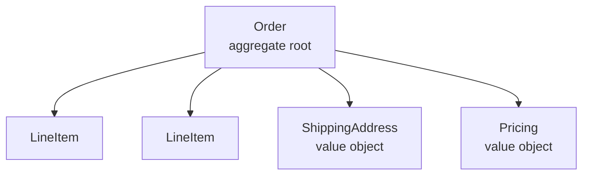
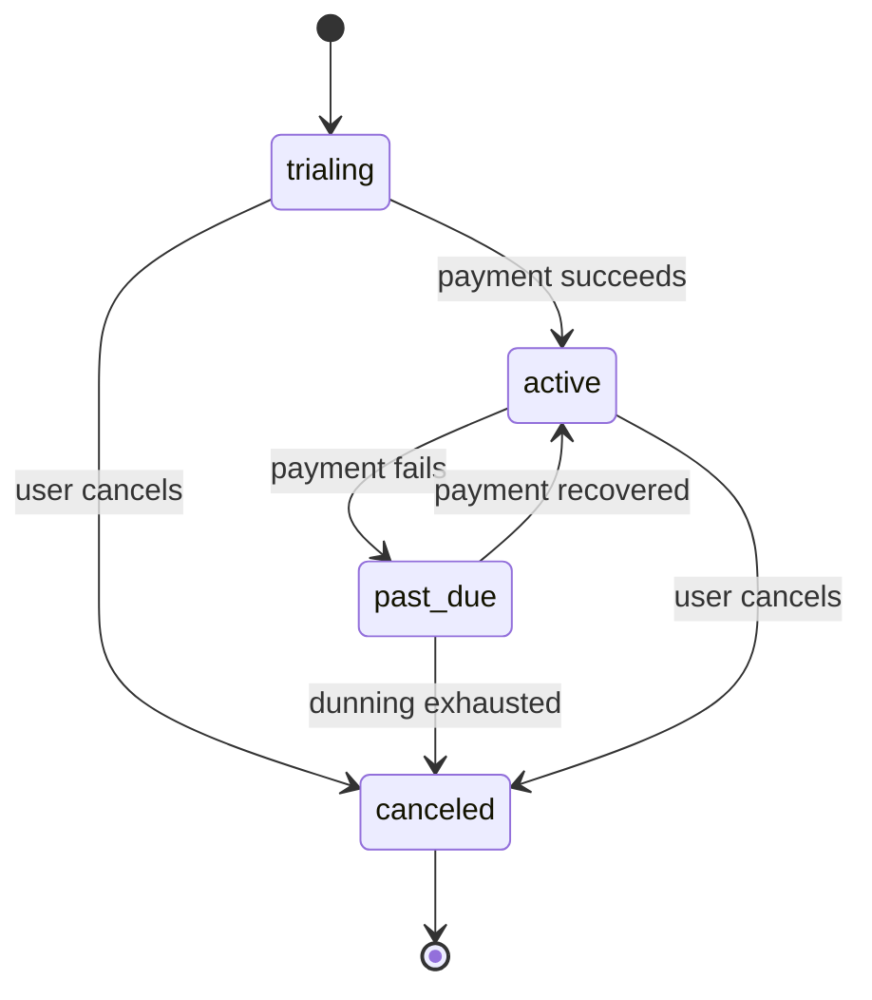

# Discovering and describing the domain model

This reference helps wiki authors find the domain model hiding inside a codebase and write wiki pages that capture it accurately. Most non-trivial codebases encode a domain model — even ones that don't use DDD terminology. The job is to surface it: the nouns the business cares about, the rules that keep them consistent, the events they emit, and the vocabulary the team uses to talk about them.

This reference is for the agent writing `primitives/` pages and any domain-heavy subsystem page. Read it before writing those pages. It also helps during the survey pass, when deciding whether something is a foundational domain object worth its own page.

## Contents

- [Why this matters](#why-this-matters)
- [What a domain model is](#what-a-domain-model-is)
- [When to read this reference](#when-to-read-this-reference)
- [Discovery signals](#discovery-signals)
  - [Lexical signals](#lexical-signals)
  - [Structural signals](#structural-signals)
  - [Behavioral signals](#behavioral-signals)
  - [Lifecycle signals](#lifecycle-signals)
  - [Invariant signals](#invariant-signals)
  - [Event signals](#event-signals)
- [Discovery by source kind](#discovery-by-source-kind)
- [Aggregate boundaries](#aggregate-boundaries)
- [Ubiquitous language](#ubiquitous-language)
- [Page structure for primitives](#page-structure-for-primitives)
- [Diagram choices](#diagram-choices)
- [Worked example](#worked-example)
- [Common pitfalls](#common-pitfalls)

## Why this matters

The domain model is what survives refactors and framework churn. Newcomers can learn the HTTP layer or the ORM by reading docs, but the *domain* — what an Order means, when a Subscription is considered overdue, why a Reservation can't overlap another — is the part they actually need to understand before making changes safely. If the wiki documents the wiring and skips the model, every page is a map of pipes with no labels.

A good domain page answers questions a reader can't answer from a single source file: "what counts as a valid X?", "what can an X contain?", "what happens when X changes state?", "what other things react to X?". The model spans many files by design; the wiki page is where the cross-file picture finally lives.

## What a domain model is

For wiki purposes, a **domain model** is the set of concepts the code treats as first-class business objects — the things the business would still care about even if you threw away the database and the API and started over. Concretely:

- **Entities** — objects with a stable identity that persists across state changes (a `User`, an `Order`, a `Subscription`). Two entities with identical fields but different IDs are different entities.
- **Value objects** — concepts defined entirely by their fields, with no identity (a `Money` amount, an `Address`, a `DateRange`). Two value objects with the same fields are interchangeable.
- **Aggregates** — clusters of entities and value objects that the system treats as a single consistency unit (an `Order` with its `LineItems`). Modifications to an aggregate happen atomically.
- **Domain events** — significant things that happened in the past (an `OrderPlaced`, a `PaymentFailed`). Events are how aggregates communicate without direct coupling.
- **Invariants** — business rules that must always hold inside an aggregate (a balance can't go negative, an order must have at least one line item).
- **Services** — operations that don't belong to a single entity (a `PricingCalculator`, a `PaymentGateway`).
- **Repositories** — abstractions over loading and persisting aggregates.

You do not need to write wiki pages that use this exact DDD vocabulary unless the codebase already does. The labels are a thinking aid. If the codebase calls them "models", "documents", "records", or "resources", use those words. The underlying concepts are what matter.

## When to read this reference

Read this when generating:

- Any page under `primitives/`, `entities/`, `core-concepts/`, or whatever the repo calls its foundational domain objects.
- The first page of a domain-heavy subsystem (an e-commerce cart, a billing engine, a scheduling system) where the business rules are the page's reason to exist.
- A `glossary.md` whose terms come from the domain.
- The `reference/data-models.md` page, when persistence is incidental and the model is the point.

Skip it for pure infrastructure (caching layers, telemetry, build tooling) — there is no business domain there.

## Discovery signals

Domain models reveal themselves through several independent signals. Combine them: each catches a different facet of the model that the others miss. A signal found by only one method is worth confirming; a signal found by three methods is almost certainly core.

### Lexical signals

The cheapest discovery method. The nouns that recur throughout the codebase are the domain nouns. The verbs are the operations.

**Find nouns:**

- Class, struct, record, interface, and type names across the codebase. Sort by frequency. Domain entities rise to the top: `User`, `Order`, `Subscription`, `Invoice`. Utility types (`Result`, `Option`, `Logger`) also rise — exclude them by directory (they live in `lib/`, `utils/`, `shared/`).
- Table names in migrations and ORM definitions. These almost always correspond to persisted aggregates or entities.
- API path segments (`/orders`, `/subscriptions/{id}/invoices`). Path nouns are the public face of the domain.
- Repeated words in commit messages and PR titles. `feat(orders): ...`, `fix(billing): ...` — the scope word is a domain area.
- File and directory names. `models/`, `domain/`, `entities/`, `aggregates/`, `core/` are explicit homes; scattered occurrences of the same noun (`order.ts`, `order_service.py`, `OrderRepository.java`) reveal an implicit aggregate.

**Find verbs:**

- Method names on domain classes: `place`, `cancel`, `refund`, `suspend`, `renew`. Each verb is a state transition or domain operation.
- Event names: `OrderPlaced`, `PaymentFailed`, `SubscriptionRenewed`. Past-tense verbs are events.
- API method names: `POST /orders/:id/cancel` — `cancel` is the verb.

A simple grep recipe:

```bash
# Most-referenced type names (likely domain entities)
rg --type-add 'src:*.{ts,js,py,go,rs,java,kt}' -t src -o '\b(class|struct|record|interface|type)\s+\w+' \
  | sort | uniq -c | sort -rn | head -40

# Table names from migrations
rg -o 'create_table[:( ]["\x27]?(\w+)' -r '$1' db/migrate/ 2>/dev/null \
  | sort | uniq -c | sort -rn
```

### Structural signals

Type definitions tell you the *shape* of the model — fields, types, nesting. These reveal value objects, embedded sub-structures, and relationships.

- **Records / dataclasses / structs with pure fields** — usually value objects (`Money { amount, currency }`, `Address { line1, city, country }`).
- **Classes with an `id` field plus mutable state** — usually entities (`User { id, email, status, ... }`).
- **Types that contain collections of other types** — usually aggregate roots (`Order { id, items: LineItem[] }`).
- **Sealed / discriminated unions** — usually domain events or state enums (`type OrderState = 'pending' | 'paid' | 'shipped' | 'cancelled'`).
- **Enums** — closed sets of states, categories, or roles. Each variant often has business meaning.
- **Foreign keys and join tables** — relationship signals. A `customer_id` on `Order` means `Order` belongs to a `Customer`.
- **Validation annotations / decorators** (`@NotNull`, `min=0`, `email`) — embedded invariants.

### Behavioral signals

Fields alone don't capture the model. The methods tell you what the model *does*.

- **State-mutating methods** on a domain class (`cancel()`, `refund(amount)`, `renew()`) define the legal transitions. List them; each one is a potential state transition in the page.
- **Methods that throw domain exceptions** (`throw new InsufficientFundsError()`) reveal invariants. The exception name is the rule, stated negatively.
- **Factory methods and named constructors** (`Order.create()`, `Order.fromDraft()`, `Subscription.trial()`) reveal the legal ways to enter the model.
- **Methods that emit events** (`this.events.push(new OrderPlaced(...))`) — domain events, captured at the source.
- **`async` methods that call external services** (`chargeCard`, `sendEmail`) — usually a domain service, not part of the aggregate.

Behavioral signals are why you cannot document a domain model from the type definitions alone. A `User` with a `status` field tells you status exists; `user.suspend()` and `user.reactivate()` tell you the *transitions that are allowed*.

### Lifecycle signals

Every entity has a lifecycle: how it's born, how it changes state, how it ends. Lifecycle is the spine of a domain page.

Look for:

- **Creation entry points** — factories, constructors, builders, `POST /widgets`. What invariants are enforced at birth? (E.g., "an Order must be created with at least one LineItem and a non-null ShippingAddress".)
- **State transitions** — explicit status fields, state enums, `transition_to` methods. Build the state machine.
- **Validation checkpoints** — when does the code reject a change? `validate_for_publish()`, `assert_can_cancel()`. Each check is an invariant in disguise.
- **Soft-delete vs hard-delete** — how does the model end? Is it archived, marked inactive, or destroyed? Some models never delete (financial records); say so.
- **Reanimation** — can a cancelled/archived entity come back? `reopen()`, `restore()`?

When you find a status field, ask: which transitions are legal, and which are forbidden? The forbidden ones are often the more interesting story ("you can't cancel a shipped order").

### Invariant signals

Invariants are the business rules that must always hold. They are the single most valuable content of a domain page — and the easiest to miss, because they are scattered across validation code, asserts, DB constraints, and comments.

Sources:

- **Inline assertions** — `assert order.items.length > 0`, `require(balance >= 0, ...)`.
- **Custom exceptions** with domain names — `InsufficientFundsError`, `OverlappingReservationError`. The exception's name and message encode the rule.
- **Database constraints** — `CHECK (balance >= 0)`, `UNIQUE(email)`, `NOT NULL`. These survive ORM rewrites.
- **Validation libraries** — `zod`, `pydantic`, `class-validator`, `validator.js`. Their rules are invariants expressed as code.
- **Comments near validation** — `// must match the customer's currency` — informal but often the only place a non-obvious rule is stated.
- **Test names** — `it_rejects_an_order_with_no_items`, `cannot_refund_more_than_charged`. Test names are a free catalog of invariants.

List invariants as a bulleted block on the page. One sentence each, plain language. Source each one to the file that enforces it.

### Event signals

Domain events reveal what other parts of the system (and the outside world) care about. They are the model's *outgoing* interface.

- **Event classes** with past-tense names (`OrderPlaced`, `InvoicePaid`). Found in `events/`, `domain/events/`, or as union types.
- **Event emitters** — `bus.emit(...)`, `pubsub.publish(...)`, `eventStore.append(...)`. What gets emitted, and from where?
- **Event consumers** — message handlers, queue workers, projection builders. Each consumer is a downstream system that depends on this model.
- **Webhook definitions** — outgoing HTTP events sent to external systems. These are public, versioned domain events.
- **Outbox tables** (`outbox`, `domain_events`) — persistence-layer event logs.

Build an events table: event name, when it's emitted, who listens. This is the model's public contract with the rest of the system.

## Discovery by source kind

Different source languages and frameworks encode the model differently. Use the right probe for what the repo actually uses.

### TypeScript / JavaScript

- `type`, `interface`, `class` declarations in `src/models/`, `src/domain/`, `packages/*/src/`.
- Discriminated unions for events and states: `type OrderEvent = { type: 'OrderPlaced'; ... } | { type: 'OrderCancelled'; ... }`.
- `zod` schemas — runtime invariants and the source of truth for many TS codebases.
- Decorators (`class-validator`, TypeORM, Prisma): each decorator is a field constraint.
- ORM schema files (`schema.prisma`, TypeORM entities, Drizzle schemas) — structural source of truth.

```bash
# Type/interface/class declarations grouped by frequency
rg -t ts -o '\b(type|interface|class)\s+\w+' \
  | sort | uniq -c | sort -rn | head -40

# zod schemas (often the runtime model)
rg '\.object\(|z\.object\(' --type ts -l
```

### Python

- `@dataclass`, `TypedDict`, `BaseModel` (Pydantic) — value objects and entities.
- Pydantic validators (`@field_validator`, `@model_validator`) — invariants.
- SQLAlchemy / Django models — persisted shape (often anemic; check for service-layer methods that mutate them).
- `Enum` subclasses — closed sets of states / categories.
- Domain-specific exceptions — `class InsufficientFundsError(Exception)`.

```bash
rg --type py -o '\b(class\s+\w+\(.*(?:BaseModel|Model|.*Mixin).*\))' \
  | sort | uniq -c | sort -rn | head -30
```

### Go

- Structs with methods on the pointer receiver are entities (`type Order struct { ... }; func (o *Order) Cancel() error`).
- Value receivers signal value objects.
- Interfaces reveal service contracts (`type OrderRepository interface { ... }`).
- Error sentinels (`var ErrInvalidOrder = errors.New(...)`) — invariant signals.

### Rust

- `struct` + `impl` blocks — entities.
- `enum` with variants — state machines, events, results.
- `newtype` patterns (`pub struct UserId(pub Uuid)`) — domain IDs.
- Trait implementations — service contracts and capabilities.

### Java / Kotlin

- `@Entity` (JPA) — persisted entities.
- `record` (Java 16+, Kotlin data classes) — value objects.
- Bean Validation annotations (`@NotNull`, `@Positive`, `@Size`) — field invariants.
- Custom exceptions extending domain base classes.

### SQL migrations

Migrations are the slowest-changing, most honest source of the persisted model.

- `CREATE TABLE` names — persisted entities.
- Column types and constraints — fields plus invariants (`CHECK`, `NOT NULL`, `UNIQUE`).
- Foreign keys and join tables — relationships.
- Indexes — the fields the system queries by (often business-meaningful: `customer_id`, `status`).

```bash
# List all tables ever created
rg -i 'create table' db/migrate/ db/sql/ migrations/ 2>/dev/null
```

### ORM models

ORM model files (Prisma `schema.prisma`, Django `models.py`, Rails `schema.rb`, SQLAlchemy `models.py`) consolidate the persisted model in one place. They are usually *anemic* — fields without behavior. Use them for the structural picture, then hunt in services for the behavior.

### API schemas

API schemas are the model's public contract. They tell you which fields are exposed and how operations are named.

- **OpenAPI / Swagger** (`openapi.yaml`, `swagger.json`) — paths, schemas, request/response shapes.
- **GraphQL** (`schema.graphql`, `*.graphqls`) — types, inputs, enums, mutations. Each mutation is a domain operation.
- **Protobuf / gRPC** (`*.proto`) — messages, enums, services. Each RPC is a domain operation.
- **tRPC routers** — type-safe endpoints, often a near-1:1 mirror of the domain.

API schemas are especially useful for discovery when the codebase is large and the model is spread across many files: the schema lists every externally-visible concept in one place.

## Aggregate boundaries

An **aggregate** is the unit of consistency: a cluster of objects that must stay consistent together, accessed through a single root. Discovering aggregate boundaries is what separates a useful domain page from a glorified schema dump.

Signals for boundary location:

- **Transactions** — what gets saved together? If `order.save()` persists the order and its line items atomically, that's an aggregate.
- **Loading patterns** — repositories that `include` or `select_related` a set of children are loading aggregates.
- **Foreign key direction** — if `LineItem` has `order_id` but no repository of its own, it's part of the `Order` aggregate.
- **Invariants that span objects** — if a rule requires checking both `Order` and its `LineItems`, they're in the same aggregate.
- **Locking** — `SELECT ... FOR UPDATE` or document-level locks that span a set of rows reveal the consistency boundary.

Document aggregate boundaries explicitly on the page. A simple diagram works:



State which children are loaded eagerly, which are accessed only through the root, and which cross-aggregate references are by ID only (the typical pattern).

## Ubiquitous language

Every team has its own vocabulary. Sometimes it matches the code; sometimes the code has drifted; sometimes the code uses one term and the product uses another. The wiki's job is to record the *current shared vocabulary*, with notes on aliases and known mismatches.

For each primitive page, include a short **Ubiquitous language** block:

| Term | Aliases | Means |
|---|---|---|
| Subscription | sub, plan | A recurring billing relationship between a Customer and a Product |
| Subscription period | cycle, billing period | The time window a single charge covers |
| Dunning | retry flow | The series of retry attempts after a failed charge |

Rules:

- Use the team's preferred word as the primary term, even if the code uses a different one. Note the code's term in the Aliases column.
- If a term has multiple conflicting meanings in the codebase, call it out. Don't pick a winner silently — that hides a real source of confusion.
- Cross-link each term to its glossary entry.

## Page structure for primitives

A primitives page captures a single foundational domain object. Recommended sections (skip any that don't apply):

0. **Active contributors** — byline (see SKILL.md "Per-page active contributors").
1. **Summary** — 1-3 sentences: what this object represents in the business, in plain language. No jargon.
2. **Ubiquitous language** — the table above, scoped to this object.
3. **Shape** — the fields, their types, and what each one means. A table works well.
4. **Lifecycle** — creation, legal state transitions, terminal state. A state diagram if there are 3+ states.
5. **Invariants** — the rules that always hold. One bullet per rule, sourced to the file that enforces it.
6. **Relationships** — what this object refers to (and how — by ID, by embedding, by value), and what refers back.
7. **Events emitted** — past-tense events this object produces, with when and who listens.
8. **Key source files** — the table required by SKILL.md section 3d.

A short template:

````markdown
# Subscription

Active contributors: alice, bob

A recurring billing relationship between a Customer and a Product. Subscriptions
are billed on a schedule and transition through a defined lifecycle.

## Ubiquitous language

| Term | Aliases | Means |
|---|---|---|
| Subscription | sub, plan | A recurring billing relationship |
| Subscription period | cycle | The window a single charge covers |

## Shape

| Field | Type | Meaning |
|---|---|---|
| id | SubscriptionId | Stable identifier |
| customer_id | CustomerId | Owning customer (cross-aggregate reference by ID) |
| status | SubscriptionStatus | Current lifecycle state |
| current_period_end | DateTime | When the current period ends |

## Lifecycle



## Invariants

- `current_period_end` is always in the future while status is `active` or `trialing`.
  Enforced in `Subscription.renew()` (src/domain/subscription.ts:142).
- A subscription with status `canceled` cannot transition to `active`. Enforced in
  `Subscription.transitionTo()` (src/domain/subscription.ts:88).
- At most one active subscription per (customer, product) pair. Enforced by a
  partial unique index (db/migrate/20230101_create_subscriptions.rb:24).

## Relationships

- Belongs to a Customer (referenced by ID; not loaded eagerly).
- Has many Invoices (separate aggregate; cross-reference by ID).
- Embeds a Pricing value object (currency + amount + interval).

## Events emitted

| Event | When | Listeners |
|---|---|---|
| `SubscriptionActivated` | trial converts to active | Billing projector, email service |
| `SubscriptionPastDue` | payment fails | Dunning workflow |
| `SubscriptionCanceled` | user or dunning cancels | Retention email, analytics |

## Key source files

| File | Purpose |
|---|---|
| `src/domain/subscription.ts` | Aggregate root, state transitions, invariants |
| `src/domain/events/subscription-events.ts` | Event definitions |
| `db/migrate/20230101_create_subscriptions.rb` | Schema and constraints |
````

## Diagram choices

Pick the diagram type that matches the question the reader is asking:

| Question | Diagram |
|---|---|
| What states can this object be in? | `stateDiagram-v2` |
| How is this object composed from other types? | `graph TD` showing the aggregate tree |
| What happens when this object is created? | `sequenceDiagram` across the services involved |
| How does this object relate to others? | `classDiagram` or `erDiagram` |
| What events fire during a workflow? | `sequenceDiagram` with `->>Bus: EventName` arrows |

Keep diagrams small (5–15 nodes). If a state machine has 12 states, split it by lifecycle phase (e.g., "Creation flow" and "Renewal flow"). Mermaid `pie` charts are not supported by the renderer — use `xychart-beta` or tables instead.

## Worked example

Suppose the survey surfaces a `src/domain/order.ts` file with a class `Order` containing `id`, `customer_id`, `status`, `items: LineItem[]`, methods `addItem`, `removeItem`, `submit`, `cancel`, and references to events `OrderSubmitted`, `OrderCancelled`. The structural scan finds migrations `create_orders` and `create_line_items`, with a foreign key from `line_items.order_id` to `orders.id`. A grep for `throw new` inside `order.ts` surfaces `EmptyOrderError`, `AlreadySubmittedError`, and `CannotCancelShippedOrderError`.

From these signals:

- **Aggregate**: `Order` is the aggregate root; `LineItem` is a child inside it (no separate repository, persisted atomically).
- **Lifecycle**: states include `draft`, `submitted`, `cancelled` (and probably `shipped` — inferred from `CannotCancelShippedOrderError`). State transitions: `submit` (draft → submitted), `cancel` (draft or submitted → cancelled, but not shipped).
- **Invariants**: order must not be empty (`EmptyOrderError`), can't submit twice (`AlreadySubmittedError`), can't cancel after shipping (`CannotCancelShippedOrderError`).
- **Events**: `OrderSubmitted`, `OrderCancelled`. Need to find consumers (search for handlers/`on`).
- **Relationships**: `Order` references `Customer` by `customer_id` (cross-aggregate). Embeds `LineItem[]`.

Write the page using the structure above. Each invariant bullet cites its source file and line. The lifecycle is a state diagram. The events table is filled after grepping for handlers. The page now answers every question a reader might have about an Order without making them read 600 lines of `order.ts`.

## Common pitfalls

- **Documenting the schema, not the model.** A page that lists every column of `orders` and nothing else is a data dictionary, not a domain page. The model is the *behavior*, *rules*, and *vocabulary* on top of the schema.
- **Skipping invariants.** Invariants are the highest-value content and the most-skipped. They take effort to find (scattered across validation code) but are exactly what a reader can't reconstruct from the type definitions.
- **Inventing a vocabulary.** If the team calls it a "subscription" but the code calls it a `RecurringPlan`, do not silently pick one. Record both, note which is canonical, and call out the mismatch.
- **Drawing aggregate boundaries from foreign keys alone.** FKs show structural relationships, not consistency boundaries. Always cross-check with transaction boundaries and repository patterns.
- **Treating events as implementation detail.** Events are the model's public contract. List them and their consumers on the page — that's the contract the rest of the system depends on.
- **Missing the forbidden transitions.** State machines that only show legal transitions hide half the business rules. Call out the *forbidden* transitions (and why) — those are usually the more interesting content.
- **Cramming every type into `primitives/`.** A type that appears in only one subsystem belongs on that subsystem's page, not on a primitives page. Primitives are for concepts that span 3+ systems.
- **Skipping the page when the model is implicit.** Many codebases have no `domain/` directory but still have a rich model living in service classes and ORM models. Discover it from behavior and events, not just from directory names.
