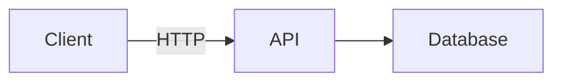

# VitePress viewer reference

This reference covers the optional embedded VitePress viewer for a generated wiki. The wiki skill produces plain markdown by default; VitePress is an add-on that wraps the markdown with a hosted, browsable web UI.

## Contents

- [Prerequisites](#prerequisites)
- [First-time setup](#first-time-setup)
- [Regenerating after wiki updates](#regenerating-after-wiki-updates)
- [Available npm scripts](#available-npm-scripts)
- [What the adapter writes](#what-the-adapter-writes)
- [Ownership contract](#ownership-contract)
- [Customization](#customization)
- [Mermaid diagrams](#mermaid-diagrams)
- [Search](#search)
- [Common issues](#common-issues)
- [Disabling the viewer](#disabling-the-viewer)

## Prerequisites

- **Node.js 20 or newer** — VitePress 1.x requires Node 20+. Check with `node --version`.
- **npm 10+** — ships with Node 20. pnpm and yarn also work.

No global installs are needed. VitePress and the Mermaid plugin are installed as local devDependencies inside the wiki directory.

## First-time setup

After the wiki has been generated (Section 5 of `SKILL.md`):

```bash
# 1. Run the adapter against the wiki directory.
node <skill-path>/scripts/setup-vitepress.mjs path/to/wiki

# 2. Install dependencies (one-time, or whenever package.json changes).
cd path/to/wiki
npm install

# 3. Start the dev server.
npm run docs:dev
# Live preview at http://localhost:5173
```

The adapter prints the resolved title, page count, and section count, plus the paths it wrote.

### Overriding the title or description

By default the site title is derived from the first page in `pageOrder` (the root `index.md` landing page, whose H1 is the project name). A trailing "overview" is also stripped as a safety net for wikis generated before the landing page existed. To override:

```bash
node <skill-path>/scripts/setup-vitepress.mjs path/to/wiki \
  --title "Acme Platform" \
  --description "Internal engineering wiki for the Acme platform"
```

## Regenerating after wiki updates

Whenever the wiki is regenerated (new pages, reordered sections, removed files), re-run the adapter to refresh `config.ts` from the updated `.wiki-meta.json`:

```bash
node <skill-path>/scripts/setup-vitepress.mjs path/to/wiki
```

The adapter is idempotent. It only rewrites `config.ts` and `package.json`. User-owned files (see [Ownership contract](#ownership-contract)) are preserved.

If the package versions in `package.json` changed (rare — only when the skill is updated), re-run `npm install` after the adapter.

## Available npm scripts

The generated `package.json` defines three scripts:

| Script | Purpose |
|---|---|
| `npm run docs:dev` | Start the live dev server with hot reload (default port 5173) |
| `npm run docs:build` | Produce a static HTML site in `.vitepress/dist/` |
| `npm run docs:preview` | Serve the built site locally to verify the production output |

For routine editing, use `docs:dev`. For publishing the wiki anywhere (static host, object storage, internal web server), run `docs:build` and serve the contents of `.vitepress/dist/` with any static file server (nginx, caddy, `python -m http.server`, GitHub Pages, Netlify, Vercel, Cloudflare Pages, etc.).

## What the adapter writes

```
wiki/
├── .vitepress/
│   ├── config.ts          # Skill-owned. Regenerated every run.
│   └── theme/
│       ├── index.ts       # Written once. User-owned after first write.
│       ├── custom.css     # Written once. User-owned after first write.
│       └── ...            # User-owned overrides (preserved).
└── package.json           # Skill-owned. Regenerated every run.
```

`config.ts` contains:

- `title` and `description` for the site
- `cleanUrls: true` (so `/overview/` works without `.html`)
- `lastUpdated: true` (shows git commit date on each page)
- `themeConfig.sidebar` — built from `pageOrder`, grouped by `topLevelSections`, with labels pulled from each page's first `# ` heading
- `themeConfig.nav` — a minimal top navbar with a Home link
- `themeConfig.search` — VitePress's built-in local (offline) full-text search
- `themeConfig.outline` — on-page outline of H2 and H3 headings
- `withMermaid(...)` wrapper — enables Mermaid diagram rendering

## Ownership contract

| File | Owner | Regenerated? |
|---|---|---|
| `.vitepress/config.ts` | Skill | Yes, every adapter run |
| `package.json` | Skill | Yes, every adapter run |
| `.vitepress/theme/index.ts` | User (written once by skill) | Only if missing |
| `.vitepress/theme/custom.css` | User (written once by skill) | Only if missing |
| `.vitepress/theme/*` (other files) | User | Never |
| `.vitepress/dist/` | Build output | Yes, on `docs:build` |
| `node_modules/` | Tooling | Yes, on `npm install` |

**The skill owns the sidebar.** Do not edit `config.ts` by hand — the next adapter run will overwrite it. To customize the sidebar's appearance or add custom components, do it through theme overrides (see below).

## Customization

### Theme overrides

Files under `.vitepress/theme/` are preserved across adapter runs. The skill writes `index.ts` and `custom.css` once on first run as starting points; after that they are yours to edit.

**Custom CSS** — `.vitepress/theme/custom.css`:

```css
:root {
  --vp-c-brand-1: #ff6b35;
  --vp-c-brand-2: #e85a2c;
}
```

The generated `index.ts` already imports `./custom.css`, so changes take effect on the next dev-server reload.

**Custom Vue components** — drop `.vue` files in `.vitepress/theme/components/` and register them by extending the theme in `index.ts`:

```ts
import DefaultTheme from 'vitepress/theme'
import './custom.css'
import MyComponent from './components/MyComponent.vue'

export default {
  extends: DefaultTheme,
  enhanceApp({ app }) {
    app.component('MyComponent', MyComponent)
  },
}
```

Note: Mermaid rendering does **not** require any theme registration. The `withMermaid()` wrapper in `config.ts` handles everything via a vite plugin that auto-registers the `<Mermaid>` Vue component.

### Navbar customization

The default navbar has a single Home link. To add more links (e.g., to a GitHub repo, external API docs), do **not** edit `config.ts` directly. Instead, ask the wiki skill to regenerate with the new navbar contents, or wrap the config: create `.vitepress/theme/config-wrapper.ts` that imports the generated config and overrides `themeConfig.nav`, then point `index.ts` at it.

In practice, most users don't need navbar changes — the sidebar already provides full navigation.

### Sidebar appearance

VitePress sidebars support `collapsed: true/false` per group. The adapter sets `collapsed: false` for all groups (everything expanded by default, since wikis are for browsing). To make large wikis collapse by default, regenerate via a forked adapter or post-process `config.ts` after running the adapter (note: the post-process will be lost on next adapter run).

## Mermaid diagrams

Mermaid is enabled by default via `vitepress-plugin-mermaid`. Any fenced code block with the `mermaid` language tag renders as a diagram:

````

````

Supported diagram types: flowchart (`graph`), sequence, class, state, ER, gantt, pie, journey, mindmap, timeline. See the [Mermaid docs](https://mermaid.js.org/intro/) for syntax.

If Mermaid diagrams render as raw text:

1. Verify `.vitepress/config.ts` wraps the config in `withMermaid(...)`. The plugin auto-registers the `<Mermaid>` Vue component via a vite transform; no `theme/index.ts` changes are required.
2. Verify `mermaid` and `vitepress-plugin-mermaid` are in `devDependencies` (they should be, from `package.json`).
3. Restart the dev server (`npm run docs:dev`).

## Search

The adapter uses VitePress's built-in **local search** (`search.provider: 'local'`). It works offline, builds a client-side index at build time, and is sufficient for typical wiki sizes (up to a few hundred pages).

To use Algolia DocSearch instead (recommended only for very large public docs sites with significant traffic), replace the `search` block in `config.ts`. Since the skill regenerates `config.ts`, you'll need to either:

- Maintain the override through a config wrapper (see [Navbar customization](#navbar-customization)), or
- Fork the adapter to emit the Algolia config.

For most internal wikis, local search is the right choice.

## Common issues

### Home link (`/`) returns 404

The navbar's Home link points to `/`, which VitePress serves from the root `index.md`. If that file is missing (e.g., the wiki was generated by an older version of the skill that didn't produce a landing page), regenerate the wiki so the root `index.md` is written, then re-run the adapter. The root `index.md` is the only file that serves the root route.

### `command not found: vitepress`

Run `npm install` first. VitePress is installed as a local devDependency, not globally. The `docs:*` npm scripts handle the path resolution.

### Dev server shows old content after wiki regen

Two causes:

1. **Adapter not re-run.** The sidebar reflects `pageOrder`, which lives in `.wiki-meta.json`. After regenerating the wiki, re-run `setup-vitepress.mjs` to refresh `config.ts`.
2. **Browser cache.** Hard-refresh (Ctrl+Shift+R / Cmd+Shift+R) or restart the dev server.

### Build fails with "Cannot find module 'vitepress'"

`node_modules/` is missing or out of date. Run `npm install`. If `package.json` was regenerated by a newer skill version with bumped dependency versions, also run `npm install` to update the lockfile.

### Sidebar shows wrong page titles

The adapter pulls titles from the first `# ` heading in each markdown file. If a page is missing an H1, the adapter falls back to the filename stem. Add an H1 to the page and re-run the adapter.

### Page appears under the wrong section

The adapter groups pages by the first component of their path. A file at `apps/cli.md` lands in the "Apps" group; a file at `apps/cli/index.md` also lands in the "Apps" group, nested under a "CLI" sub-group. If a page shows up in an unexpected place, check its path in `.wiki-meta.json`'s `pageOrder`.

### Node version errors

VitePress 1.x requires Node 20+. Run `node --version`. If you're on an older Node, upgrade or use a version manager (nvm, fnm, volta).

## Disabling the viewer

To remove VitePress and return to plain-markdown mode:

```bash
cd path/to/wiki
rm -rf .vitepress package.json package-lock.json node_modules
```

The markdown files under `wiki/` are untouched. The wiki continues to work as plain markdown in any viewer.
