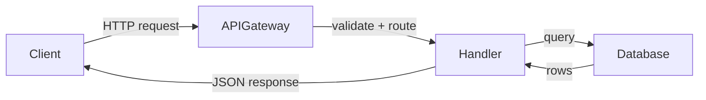

# Codebase wiki

Read a repository, then produce a set of interconnected documentation pages that explain what the code does and how it fits together. The output is a `wiki/` directory of markdown files, ready to be read by any markdown viewer or published with a static site generator.

## Workflow overview

The wiki is generated in six phases. The top-level agent orchestrates survey, planning, foundation pages, and assembly; domain pages are delegated to sub-agents for depth and parallelism.

```
1. SURVEY (top-level)
   Structural scan + deep code scan + business-logic discovery
   Produce: survey_context (incl. business-logic topic list)
        │
        ▼
2. PLAN (top-level)
   Decide lens sections, list all pages, mark criticality,
   tag each business-logic page with its template (workflow/policy/calculation)
   Produce: page_plan (JSON with per-page briefs)
        │
        ▼
3. FOUNDATION PAGES (top-level, sequential)
   Write: index.md, overview/*, how-to-contribute/patterns-and-conventions
   These establish shared vocabulary and conventions
        │
        ├────────────────────────────────────────┐
        ▼                                        ▼
4a. LENS PAGES (sub-agents, parallel)     4b. DATA PAGES (sub-agents, parallel)
    Critical pages: 1 agent each               by-the-numbers
    Normal pages: batched 3-5                  lore
    Each agent writes its page(s)              fun-facts
    + sub-pages if warranted
    Business-logic pages: dedicated agent each,
      MUST read references/business-logic.md
      and use the workflow/policy/calculation template
      (NOT the subsystem template)
        │                                        │
        ├────────────────────────────────────────┘
        ▼
5. REMAINING PAGES (sub-agents, parallel)
   how-to-contribute/ (remaining pages)
   Conditional sections: api, deployment, security,
     how-to-monitor, background, cleanup-opportunities
   reference/ + maintainers.md
        │
        ▼
6. ASSEMBLY (top-level)
   Cross-link audit, .wiki-meta.json
   Write wiki directory to its final location
        │
        ▼
7. VIEWER (optional, top-level)
   If the user asked for a hosted/browsable web UI,
   run the bundled VitePress adapter against .wiki-meta.json
   to emit .vitepress/config.ts + package.json
```

## Reference files

This skill uses progressive disclosure. The SKILL.md you are reading contains the orchestration workflow. Detailed methodology for each phase lives in reference files — read them at the point in the workflow where they apply.

| File | Read it when | What it covers |
|---|---|---|
| `references/survey.md` | Section 1 (Survey) | The three survey passes, coverage cross-check, survey output format |
| `references/page-structure.md` | Section 2 (Plan) and Section 3 step 2 (delegating pages) | Always-present pages, organizational lenses, conditional sections, page ordering, nesting/naming/title rules, file structure tree, meta file schema, special page content specs (by-the-numbers, lore, fun-facts, maintainers, monitoring, cleanup) |
| `references/business-logic.md` | Writing any workflow/policy/calculation page | Behavioral discovery methods, signal groups, page templates for business logic |
| `references/domain-model.md` | Writing any `primitives/` page or domain-heavy subsystem page | Domain model discovery signals, aggregate boundaries, ubiquitous language, primitives page template |
| `references/vitepress.md` | Section 6 (VitePress viewer) | VitePress setup, customization, troubleshooting |

## 1. Survey the repository

Before writing anything, build a mental model of the codebase through three mandatory passes, followed by a coverage cross-check.

- **Pass 1: Structural scan** — read config files, entry points, CI/CD, build config, and directory listings to map what the project does, its major subsystems, data flows, dependencies, and build/test commands.
- **Pass 2: Deep code scan** — probe the code for features, domains, and capabilities invisible from directory names: feature flags, routes, API endpoint groups, service classes, event handlers, and domain-specific directories.
- **Pass 3: Business-logic discovery** — find the behavior (workflows, decisions, calculations, cross-aggregate rules) that structural scans miss. This is mandatory because business logic is the code readers most often need to change, and it doesn't gather in any one directory.

**Read `references/survey.md` for the full methodology** — the file lists, probing techniques, the four business-logic signal groups, exhaustive subsystem discovery, often-missed areas, and the three-source coverage cross-check that ensures nothing is silently omitted.

The survey produces a **survey context document** (repo summary, architecture overview, discovered topics, business-logic topics, key patterns, glossary seeds, directory-to-purpose map) that is shared with all sub-agents. See `references/survey.md` for the exact format.

## 2. Plan the table of contents

Design a page tree before writing any prose. The wiki has three tiers of content: always-present pages, organizational lenses, and conditional sections.

**Read `references/page-structure.md` for the complete specification** — it defines every page type, the five organizational lenses (apps, systems, features, packages, primitives) with selection heuristics, all conditional sections, page ordering, nesting/naming/title rules, and the file structure tree.

After reading the reference, produce a **page plan** — a structured list of every page the wiki will contain. For each page:

- **Path** — the file path (e.g., `apps/cli/index.md`)
- **Title** — the page heading
- **Template** — which page template to use: `subsystem` (default for apps/systems/features/packages pages), `primitives` (foundational domain objects, see `references/domain-model.md`), or `workflow` / `policy` / `calculation` (business behavior, see `references/business-logic.md`). Tagging this at planning time is what ensures business-logic pages reach a sub-agent that knows to use the right template.
- **Criticality** — `critical` (gets a dedicated sub-agent) or `normal` (batched with related pages)
- **Content brief** — 2-3 sentences describing what the page should cover and what code paths to read
- **Relevant source paths** — specific files/directories the sub-agent should read
- **Related pages** — titles, paths, and one-line summaries of other pages being written, so the agent knows what to link to instead of explaining

**Business-logic template rule.** Any `features/` or `systems/` topic whose main content is a decision or a process — not a structural description — must be planned with a business-logic template (`workflow`, `policy`, or `calculation`), not `subsystem`. If the page answers "how does the system decide X?" use `policy`. If it answers "what happens when Y?" use `workflow`. If it answers "how is Z computed?" use `calculation`. A page that answers "what does module M contain?" uses `subsystem`. When a topic has both structural and behavioral aspects (e.g., a fraud system with its own service layer and a branching decision engine), split it: a `systems/` page for the structural overview and a separate `policy` page for the decision logic, cross-linked.

**Criticality guidelines:** Pages covering apps, packages, or features with large codebases, high churn, or central architectural roles are strong candidates for dedicated agents. Business-logic pages (workflow / policy / calculation) are also strong candidates for dedicated agents — their failure paths, configuration, and side effects are easy to get wrong when batched. The agent uses its judgment from the survey — these are guidelines, not hard rules.

## 3. Generate pages

### Step 1: Foundation pages (sequential)

The top-level agent writes these pages sequentially before any sub-agents run:

1. `index.md` — root landing page. Level-1 heading is the project name (used as the site title by static site generators). Body is a one-to-two sentence project summary plus links to the main sections planned in Step 2.
2. `overview/index.md` — project overview
3. `overview/architecture.md` — system architecture with Mermaid diagrams
4. `overview/getting-started.md` — prerequisites, install, build, test, run
5. `overview/glossary.md` — project-specific terms
6. `how-to-contribute/patterns-and-conventions.md` — coding patterns and conventions

These pages establish the shared vocabulary and architectural context that sub-agents reference. They must be complete before delegation begins.

### Step 2: Sub-agent delegation (parallel)

Two groups of sub-agents run in parallel:

**Group A — Lens pages** (all organizational lens pages: apps, systems, features, packages, primitives):

- **Critical pages** get a dedicated sub-agent each. The sub-agent reads the relevant code, writes the page, and autonomously decides whether sub-pages are warranted. The top-level agent does NOT pre-plan sub-pages for critical pages — the sub-agent explores and decides.
- **Normal pages** are batched 3-5 per sub-agent, grouped by relatedness. Batched pages are typically single files without sub-pages.
- **Business-logic pages** (any page whose plan `Template` is `workflow`, `policy`, or `calculation`) always get a dedicated sub-agent each — never batch them with subsystem pages. Their prompt MUST instruct the agent to read `references/business-logic.md` and follow the matching category template, not the subsystem template.

**Group B — Data pages** (run in parallel with lens pages since they only need git history and source file structure): `by-the-numbers.md`, `lore.md`, `fun-facts.md`. See `references/page-structure.md` for the content spec of each.

**Depth guidelines for sub-agents:** A single page should not try to cover a complex subsystem end-to-end. Sub-agents should create sub-pages when:

- The subsystem has 3+ clearly distinct internal areas (e.g., a CLI has TUI rendering, exec mode, skills system, session management — each deserves its own page)
- A single page would exceed ~2000 words to cover the topic adequately
- The subsystem has multiple entry points or distinct user-facing modes

Examples of when to split: a CLI app with 50+ source files and 4000+ line entry points → sub-pages for each major subsystem. A backend with distinct API groups, auth system, and job runner → sub-pages for each.

Examples of when NOT to split: a utility package with 5 files and a single purpose → one page. A simple microservice with one handler → one page.

### Step 3: Remaining pages (parallel)

After all lens pages complete, spawn sub-agents for:

- `how-to-contribute/` remaining pages (development-workflow, testing, debugging, tooling) as one batch
- Each conditional section as its own sub-agent or small batch: api, deployment, security, how-to-monitor, background, cleanup-opportunities
- `reference/` + `maintainers.md` as one batch

These pages can now cross-reference lens pages since they're complete.

### Sub-agent prompt template

Every sub-agent receives a prompt with this structure:

```
You are writing wiki page(s) for [repo].

## Shared Context
[The survey_context document from Step 1 — compact repo overview,
architecture, key patterns, glossary terms. Same for all agents.]

## Your Assignment
Pages: [list of pages this agent is responsible for]
Criticality: [critical or normal]
Template: [subsystem | primitives | workflow | policy | calculation — from the page plan]
Content brief: [2-3 sentences per page describing what to cover]
Relevant source paths: [specific files/directories to read]

## Related Pages (link to these, don't duplicate their content)
- apps/cli (apps/cli/index.md): "CLI architecture, entry points, and TUI rendering"
- features/llm-integration (features/llm-integration.md): "LLM provider abstraction and streaming"
- ...

## Rules
- Use the page template named in your Assignment. For subsystem/primitives pages,
  follow the page-writing guidance in this skill. For workflow/policy/calculation
  pages, you MUST first read references/business-logic.md and follow the matching
  template there. Do not fall back to the subsystem template for a business-logic
  page.
- For primitives pages, read references/domain-model.md for the discovery
  playbook and primitives-specific template.
- Maximum nesting: 2 levels (section/page.md)
- For critical pages: explore the code and create sub-pages if the topic
  has clearly distinct sub-areas. Write both the index.md and sub-pages.
- For normal pages: write single-file pages unless complexity demands splitting
- Use Mermaid diagrams when they help explain data flows or component relationships
- Cross-link to related pages listed above instead of re-explaining their topics
- Write output to [wiki_dir path]
```

The **shared context** is the same for all agents — the compact survey document. The **per-page brief** is tailored by the top-level agent during planning. This ensures no sub-agent re-discovers what the survey already found, and no sub-agent explains what another page covers.

### How to write each page

For every page:

**Read the relevant code.** Open and read the actual source files. Do not guess or hallucinate file contents. If a file is too large, read the parts that matter for the current section.

**Write prose.** Explain what the code does in plain language. Start with the high-level purpose, then drill into specifics. Every claim should be traceable to a specific file or function.

Each **subsystem** page should include these sections (skip any that don't apply):

0. **Active contributors** — a one-line byline immediately after the heading (see `references/page-structure.md` "Per-page active contributors")
1. **Purpose** — what this subsystem does, in 2-3 sentences
2. **Directory layout** — a file tree showing the key files and folders
3. **Key abstractions** — a table of the most important types with their file path and a one-line description
4. **How it works** — the main data/control flow, with a Mermaid diagram if it involves 3+ components
5. **Integration points** — how this subsystem connects to others
6. **Entry points for modification** — 2-3 sentences telling a developer where to start if they need to change or extend this subsystem

**Primitives pages use a different template.** Read `references/domain-model.md` — it covers shape, lifecycle, invariants, relationships, events emitted, and how to discover domain objects when they're implicit.

**Workflow, policy, and calculation pages use a different template too.** Read `references/business-logic.md` — it covers trigger/steps/state machine/failure/side effects/concurrency (workflow), inputs/output/rules/configuration/versioning/examples (policy), and signature/formula/inputs/constants/edge cases (calculation).

**Add Mermaid diagrams** when they illustrate something hard to describe in words:

- Use `graph TD` or `graph LR` for architecture and flow diagrams
- Use `sequenceDiagram` for request/response flows between services
- Use `stateDiagram-v2` for state machines
- Use `subgraph` to group related components in larger diagrams
- Keep diagrams focused — 5 to 15 nodes maximum. Split larger diagrams into multiple smaller ones
- Label edges with the action or data being passed
- Do not use Mermaid for simple relationships that a sentence can explain
- Do NOT use Mermaid `pie` charts — they are not supported by the renderer. Use `xychart-beta` or tables instead.

Example:

````markdown

````

**Add file references.** Each domain page must include a "Key source files" table:

```markdown
| File | Purpose |
|---|---|
| `src/auth/middleware.ts` | Validates JWT tokens, attaches user to request |
| `src/auth/token-service.ts` | Token creation, refresh, and revocation |
```

Reference every file you mention in prose. When mentioning a class, interface, function, or type, include its file path in backticks on first mention.

**Cross-link pages.** Link between pages using relative markdown links:

```markdown
For details on how the auth middleware integrates with the API layer,
see [API authentication](../api/authentication.md).
```

Each page should link to at least one other page — the reader should be able to navigate the wiki without using the sidebar.

## 4. Assembly

The top-level agent does a final pass:

- Audit cross-links between pages (fix broken references, add missing links)
- Write `.wiki-meta.json` with final page list and ordering
- Verify all directories have `index.md` files

The meta file schema and page ordering rules are in `references/page-structure.md`.

## 5. Write the wiki to disk

The wiki is a plain directory of markdown files. There is no product-specific upload step — write all pages directly to the final destination directory so they can be read by any markdown viewer, committed to the repo, or published with a static site generator.

### Default output location

Write to a `wiki/` directory at the repository root unless the user asks for a different location:

```
<repo-root>/wiki/
├── .wiki-meta.json
├── index.md
├── overview/
│   └── ...
└── ...
```

If the user specifies a destination (e.g., `docs/wiki/`, a sibling repository, or a specific path), honor it.

### When the user does not want files left on disk

If the user explicitly asks not to leave the wiki on disk, write to a temporary directory and let the user move or discard it:

```bash
WIKI_TMPDIR=$(mktemp -d)
# Write all wiki files into $WIKI_TMPDIR
# Hand the path back to the user; they decide whether to keep or delete it
```

### Publishing (optional)

The skill produces only markdown by default. When the user wants a hosted, browsable web UI, see Section 6 below. For other publishing targets (MkDocs, Quartz, GitHub Pages, etc.), the user provides the integration — the generated directory is already in a layout most static site generators expect.

## 6. Optional: embedded web viewer (VitePress)

By default the wiki is plain markdown. If the user wants a hosted, browsable web UI (phrases like "web view", "host the wiki", "browse the docs", "publish online", "preview the wiki", "set up a docs site"), scaffold an embedded VitePress site inside the wiki directory. VitePress is purely additive — the markdown files continue to work without it, and all viewer artifacts live inside `wiki/` so the directory stays self-contained and portable.

### When to enable

Default: do **not** enable. Enable only when the user explicitly asks for a web view, hosting, or a docs site. If the intent is ambiguous, ask once: "Do you want a hosted web view of the wiki, or just the markdown?" When in doubt, leave it out — the user can enable it later by re-running the adapter.

### Setup

The bundled adapter reads `.wiki-meta.json` and emits a complete VitePress configuration inside `<wiki-dir>/`:

```bash
node <skill-path>/scripts/setup-vitepress.mjs <wiki-dir>
cd <wiki-dir> && npm install && npm run docs:dev
```

The skill owns the generated config (`config.ts`, `package.json`); re-run the adapter whenever the wiki is regenerated. User customizations under `.vitepress/theme/` are preserved across runs.

For prerequisites, the full file list the adapter writes, customization, Mermaid and search setup, troubleshooting, and how to disable the viewer — **read `references/vitepress.md`**.

## Content principles

These apply to every page the wiki generates.

### Progressive disclosure

Start every page with a 1–3 sentence summary of what the page covers. Follow with an overview section that explains the main concepts. Put implementation details, edge cases, and configuration options later in the page.

A reader skimming the first paragraph of each page should get a useful overview of the entire system.

### Page size limit

Keep individual pages under 500KB. If a page approaches this limit, split it into sub-pages.

### Human writing rules

Write documentation that reads like a person wrote it. Technical docs are especially prone to AI-sounding patterns because the subject matter is dry. Fight that tendency.

**Specific rules to follow:**

1. **Cut inflated significance.** Do not write "serves as a testament to," "pivotal role in the evolving landscape," "setting the stage for," or "underscores the importance of." Just state what the thing does.

   Bad: "The authentication module serves as a critical pillar in the application's security landscape."
   Good: "The authentication module validates JWT tokens and attaches user context to requests."

2. **Cut promotional language.** Do not write "boasts," "vibrant," "rich," "profound," "showcasing," "exemplifies," "commitment to," "groundbreaking," "renowned," or "breathtaking." Technical docs describe; they do not sell.

   Bad: "The codebase boasts a rich set of vibrant utilities that showcase the team's commitment to developer experience."
   Good: "The `utils/` directory has helpers for string formatting, date parsing, and retry logic."

3. **Kill superficial -ing analyses.** Do not tack "highlighting," "ensuring," "reflecting," "symbolizing," "showcasing," or "contributing to" onto sentences to add fake depth.

   Bad: "The service processes events asynchronously, ensuring scalability while highlighting the system's robust architecture."
   Good: "The service processes events asynchronously. It pulls from an SQS queue and can handle ~500 events/second per instance."

4. **Avoid AI vocabulary words.** These words appear far more often in AI-generated text: additionally, crucial, delve, emphasizing, enduring, enhance, fostering, garner, interplay, intricate/intricacies, landscape (abstract), pivotal, showcase, tapestry (abstract), testament, underscore (verb), vibrant. Replace them with plainer alternatives.

5. **Skip the rule of three.** Do not force ideas into groups of three to sound comprehensive (e.g., "innovation, inspiration, and industry insights"). If there are two things, list two. If there are four, list four.

6. **Do not use copula avoidance.** Write "X is Y" or "X has Y" instead of "X serves as Y," "X stands as Y," "X represents Y," "X boasts Y," "X features Y," or "X offers Y."

   Bad: "The config module serves as the central hub for environment variable management."
   Good: "The config module reads environment variables and exports typed constants."

7. **Do not use negative parallelisms.** Avoid "It's not just X, it's Y" and "Not only X but Y" constructions.

8. **Use sentence case in headings.** Write "Getting started with authentication," not "Getting Started With Authentication."

9. **Cut filler phrases.** Replace "in order to" with "to," "due to the fact that" with "because," "it is important to note that" with nothing (just state the fact).

10. **Be specific, not vague.** Replace "industry experts believe" with a concrete reference. Replace "several components" with the actual component names. Replace "various configurations" with the actual config options.

11. **Avoid em dash overuse.** Use commas or periods instead of em dashes (—) in most cases. One em dash per page is fine; three or more is a pattern.

12. **Do not use chatbot artifacts.** Never write "I hope this helps," "Let me know if," "Here is an overview of," "Certainly!", or "Great question!" These are conversation patterns, not documentation.

### Concrete file references

Every factual claim about the code should point to the source file. Do not say "the system handles authentication" without saying where. Do not say "the database schema includes a users table" without pointing to the migration or model file.

If you cannot find the file that implements something, say so: "The retry logic is referenced in `config.ts` but the implementation was not found in the current codebase."

### Mermaid diagram usage

Include at least one Mermaid diagram in the architecture page. Include diagrams in domain pages when they help explain data flows or component relationships. Do not add diagrams to every page — a page about configuration options or environment variables probably does not need one.
